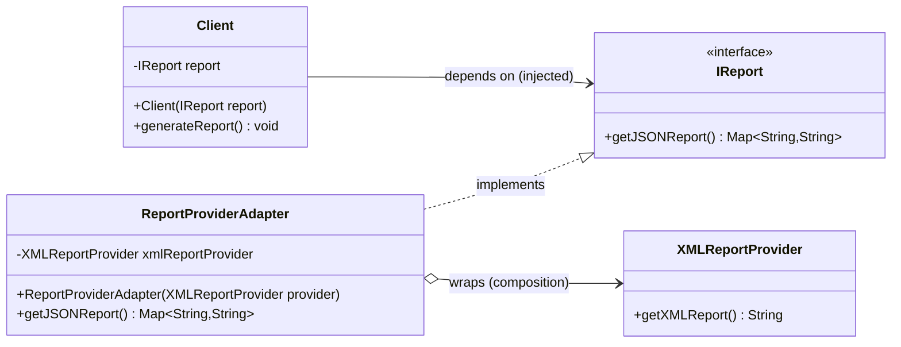
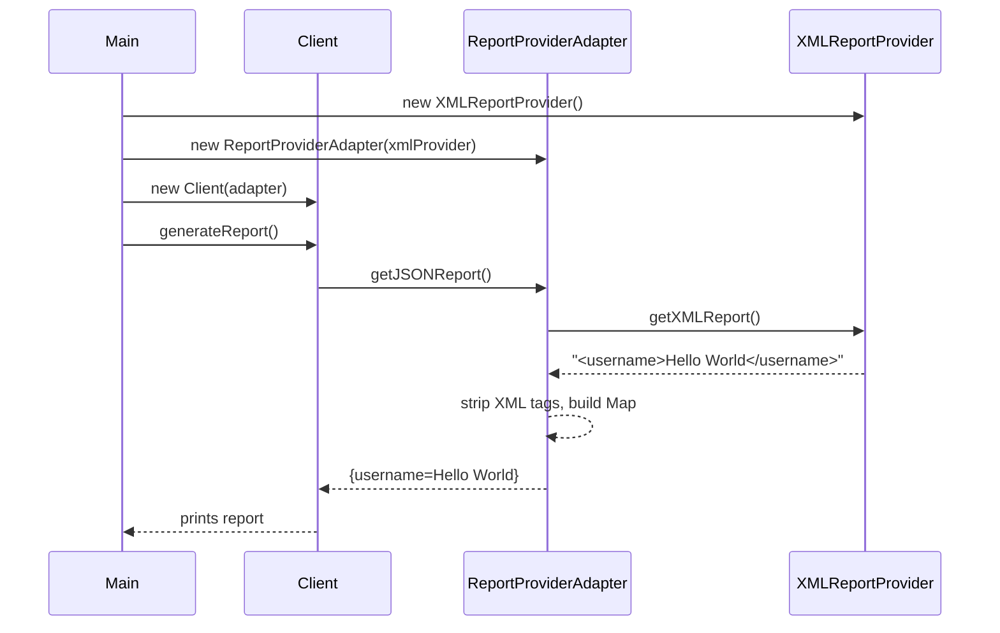

# Adapter Design Pattern — UML Diagrams

UML for this project's example: `Client` wants JSON reports (`IReport`), but the only
data source is a legacy `XMLReportProvider`. `ReportProviderAdapter` bridges the two.

---

## Class Diagram (Mermaid)



**Reading the arrows:**

| Arrow | Meaning | In this example |
|---|---|---|
| `Client --> IReport` | association / dependency | Client holds an `IReport` field (constructor-injected) |
| `ReportProviderAdapter ..|> IReport` | realization (implements) | Adapter speaks the client's language |
| `ReportProviderAdapter o--> XMLReportProvider` | aggregation (has-a) | Adapter wraps the adaptee via composition |

---

## Class Diagram (ASCII — generic GoF roles)

```
                 ┌────────────────────┐
                 │      Client        │
                 │────────────────────│
                 │ - report: IReport  │
                 │ + generateReport() │
                 └─────────┬──────────┘
                           │ depends on
                           ▼
                 ┌────────────────────┐
                 │   «interface»      │        TARGET
                 │      IReport       │
                 │────────────────────│
                 │ + getJSONReport()  │
                 └─────────△──────────┘
                           │ implements
                           │
              ┌────────────┴─────────────┐
              │   ReportProviderAdapter  │      ADAPTER
              │──────────────────────────│
              │ - xmlReportProvider      │
              │ + getJSONReport()        │──┐
              └──────────────────────────┘  │ delegates + translates
                           │ wraps (has-a)  │
                           ▼                │
              ┌──────────────────────────┐  │
              │    XMLReportProvider     │◀─┘   ADAPTEE
              │──────────────────────────│
              │ + getXMLReport(): String │
              └──────────────────────────┘
```

---

## Sequence Diagram (Mermaid)



---

## Key Structural Points

1. **The adapter sits between two interfaces that never touch each other.**
   `Client` knows only `IReport`; `XMLReportProvider` knows nothing about `IReport`.

2. **Realization + composition, not inheritance of the adaptee.**
   `ReportProviderAdapter` *implements* the target and *has-a* adaptee —
   this is the object-adapter form (the class-adapter form would `extend XMLReportProvider`,
   which is discouraged and limited by Java's single inheritance).

3. **Adding a new provider extends the diagram sideways, not upward.**
   A `CSVReportProvider` + `CSVReportProviderAdapter` would appear as a second
   implements-arrow into `IReport` — `Client` and `IReport` boxes stay untouched.
```
