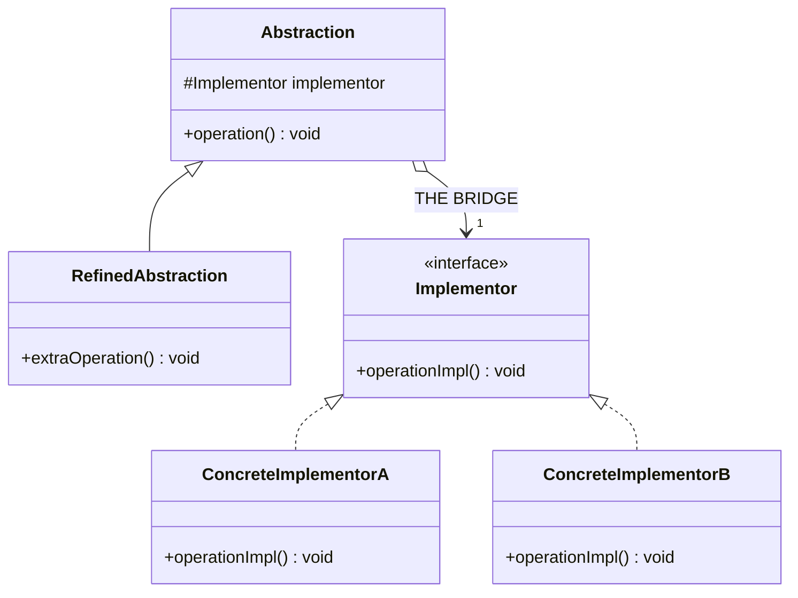
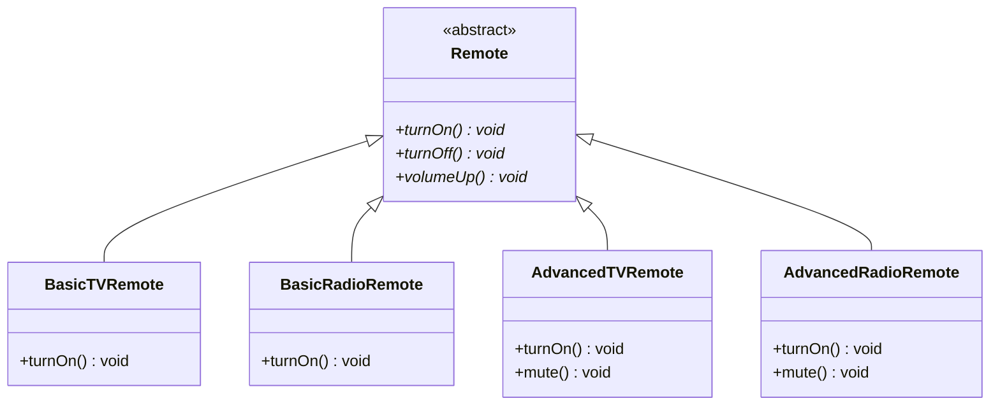
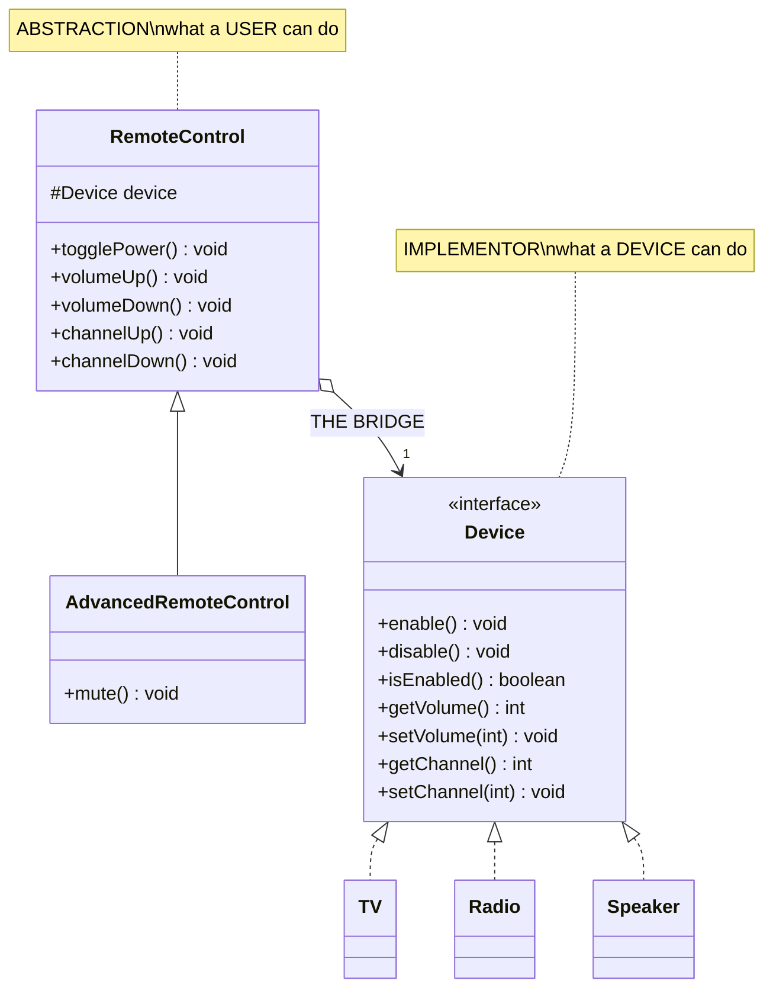
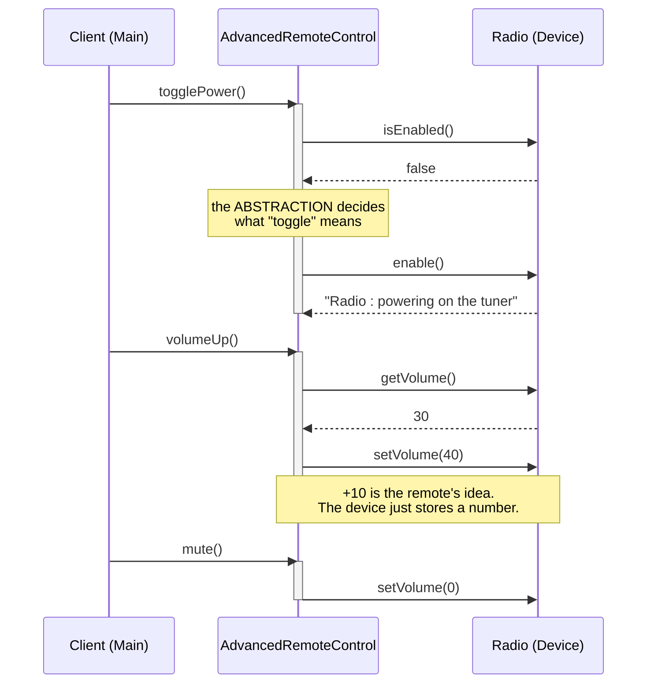

# Bridge Design Pattern — UML Diagrams

The structural signature of Bridge is **two separate hierarchies side by side**, joined by a single
arrow from the top of one to the top of the other. That arrow is the bridge.

If you can draw your classes as one tree, you don't have a Bridge. If you have to draw two, you do.

---

## 1. The Canonical Structure



Two hierarchies. **One** connection between them. Each side is free to grow downward without the
other side knowing or caring.

---

## 2. The Problem — `WithoutBridgeDesignPattern`



One tree, doing the work of two. Each leaf is a **combination**, not a concept — and the TV's power
logic is written twice, the Radio's twice.

---

## 3. The Fix — `WithBridgeDesignPattern`



| Role | Class | Varies along… |
|---|---|---|
| **Abstraction** | `RemoteControl` | — holds the bridge |
| **Refined Abstraction** | `AdvancedRemoteControl` | the **remote** dimension |
| **Implementor** | `Device` | — defines the primitives |
| **Concrete Implementor** | `TV`, `Radio`, `Speaker` | the **device** dimension |

---

## 4. ASCII — Multiplication Becomes Addition

```
  WITHOUT BRIDGE                          WITH BRIDGE
  ──────────────                          ───────────

        Remote                    RemoteControl ──────────▶ «interface»
           │                            │       (bridge)      Device
   ┌───────┼───────┐                    │                        △
   │       │       │                    ▼                        │
 BasicTV  BasicRadio                Advanced             ┌───────┼───────┐
 AdvTV    AdvRadio                  RemoteControl        TV    Radio  Speaker


  2 remotes × 2 devices = 4          2 remotes + 2 devices = 4
  + Speaker             = 6          + Speaker             = 5
  + VoiceRemote         = 9          + VoiceRemote         = 6

           R × D                              R + D
     ⚠ grows quadratically              ✅ grows linearly
```

At 2×2 they tie. That's the trap — the pattern looks pointless at the size of a tutorial example.
Add the **third** device and the two lines separate forever.

---

## 5. Sequence — A High-Level Op Built From Primitives



This is the division of labour that makes Bridge work:

- **`Device` knows nothing about "toggle", "volume up" or "mute".** It exposes dumb primitives:
  `enable`, `disable`, `setVolume`.
- **`RemoteControl` composes those primitives into user-level operations.** `togglePower()` is
  `isEnabled()` + `enable()`/`disable()`. `volumeUp()` is `getVolume()` + `setVolume(+10)`.

Get that boundary wrong and the pattern degrades. If `Device` had a `togglePower()` method, every
device would have to reimplement it, and the abstraction would have nothing left to do.

---

## Key Structural Points

1. **Two hierarchies, not one.** `TV` does **not** extend `RemoteControl`. They are unrelated trees
   that happen to hold a reference to each other's top. If you can't draw two trees, it isn't Bridge.

2. **The bridge is a field.** `protected Device device;` — one line. Composition where the naive
   design used inheritance. That substitution *is* the pattern.

3. **"Abstraction" is not `abstract`.** `RemoteControl` is concrete and instantiable. The word means
   "the higher-level concept", not the Java keyword. This trips up nearly everyone.

4. **The Implementor holds primitives; the Abstraction composes them.** Keep `Device` dumb and
   `RemoteControl` smart, or the split earns you nothing.

5. **The pairing is chosen at runtime.** `new AdvancedRemoteControl(new Speaker())` — the combination
   is an *argument*, not a class name. In the "Without" version, every valid pairing had to be
   predicted and compiled in advance.

6. **Adding to either side is a one-class change.** `Speaker` was added after both remotes existed,
   and neither remote was touched. That is the Open/Closed Principle actually paying out.
