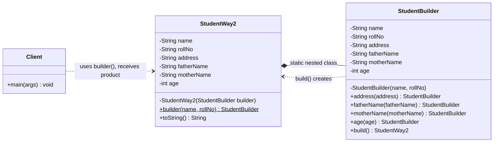
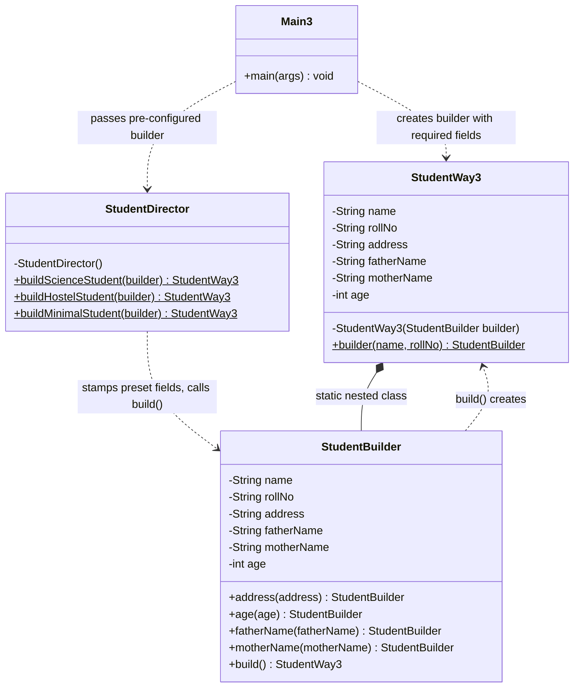
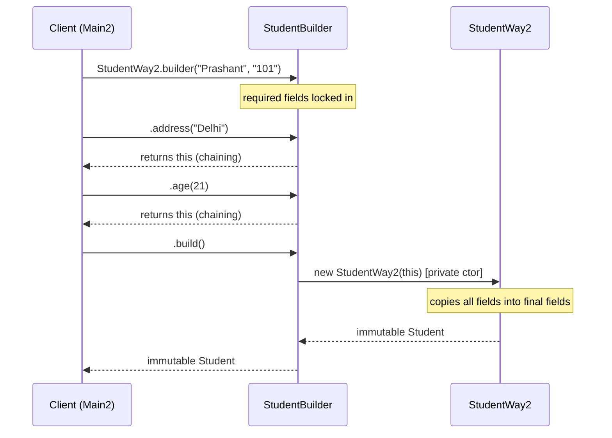
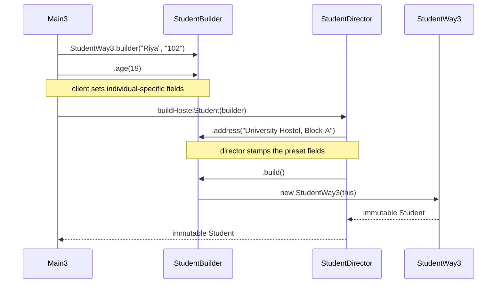

# Builder Design Pattern — UML Diagrams

UML for this project's example: building an immutable `Student` with required fields
(`name`, `rollNo`) and optional fields (`address`, `fatherName`, `motherName`, `age`),
shown in the three ways implemented in `WithBuilderDesignPattern/`.

---

## Class Diagram — Way 1 & Way 2 (Product + nested Builder)

`Student` (Way 1) and `StudentWay2` (Way 2) have the same structure; Way 2 only adds
the static factory `builder()` and makes the builder's constructor private.



**Reading the diagram:**

| Element | Meaning | In this example |
|---|---|---|
| `-StudentWay2(builder)` | private constructor | only the builder can create the product |
| `+builder(name, rollNo)$` | static factory method (`$` = static) | the only public entry point (Way 2) |
| `StudentWay2 *-- StudentBuilder` | composition / nesting | builder is a `static` nested class of the product |
| setters return `StudentBuilder` | fluent interface | enables method chaining |
| all product fields `final` | immutability | object can never change after `build()` |

---

## Class Diagram — Way 3 (with Director)



**Division of responsibility (Way 3):**

| Who | Sets |
|---|---|
| Client (`Main3`) | required fields + individual-specific fields (`age`, personal `address`) |
| Director | fixed preset fields (hostel address, science guardian) |
| Builder | assembles everything, `build()` produces the immutable product |

---

## Class Diagram (ASCII — generic GoF roles)

```
┌─────────────────┐   builder("name","roll")    ┌──────────────────────────────┐
│     Client      │────────────────────────────▶│  «static nested»             │
│   (Main/Main2/  │                             │      StudentBuilder          │
│     Main3)      │   .address(..).age(..)      │──────────────────────────────│
└───────┬─────────┘   (fluent, returns this)    │ - name, rollNo    (final)    │
        │                                       │ - address, age... (optional) │
        │ receives product                      │ + address(a): StudentBuilder │
        ▼                                       │ + age(n):     StudentBuilder │
┌─────────────────────────────┐    build()      │ + build():    Student        │
│          Student            │◀────────────────└──────────────────────────────┘
│─────────────────────────────│  calls private
│ - name:    final (required) │  constructor
│ - rollNo:  final (required) │
│ - address: final (optional) │        ┌───────────────────────────────┐
│ - age:     final (optional) │        │       StudentDirector         │
│ - Student(builder)  PRIVATE │        │  (optional — Way 3 only)      │
└─────────────────────────────┘        │───────────────────────────────│
                                       │ + buildScienceStudent(builder)│
     Director receives a pre-          │ + buildHostelStudent(builder) │
     configured builder, stamps ──────▶│ + buildMinimalStudent(builder)│
     the preset fields, builds         └───────────────────────────────┘
```

---

## Sequence Diagram — Way 2 (Mermaid)



---

## Sequence Diagram — Way 3 with Director (Mermaid)



---

## Key Structural Points

1. **The product's constructor is private and takes the builder** — the builder is
   the only door into the product, and it hands over all fields at once so the
   product's fields can be `final` (immutable).

2. **Every optional-field setter returns the builder itself** — that self-reference
   is what makes the chain `builder(...).address(...).age(...).build()` possible.

3. **Required vs optional is enforced by structure, not documentation** — required
   fields live in the builder's constructor (can't compile without them), optional
   fields are fluent setters (skip freely, default to null/0).

4. **The Director is an optional layer** — Way 1 and Way 2 have no Director at all.
   It appears only when the same preset recipe repeats across the codebase.
