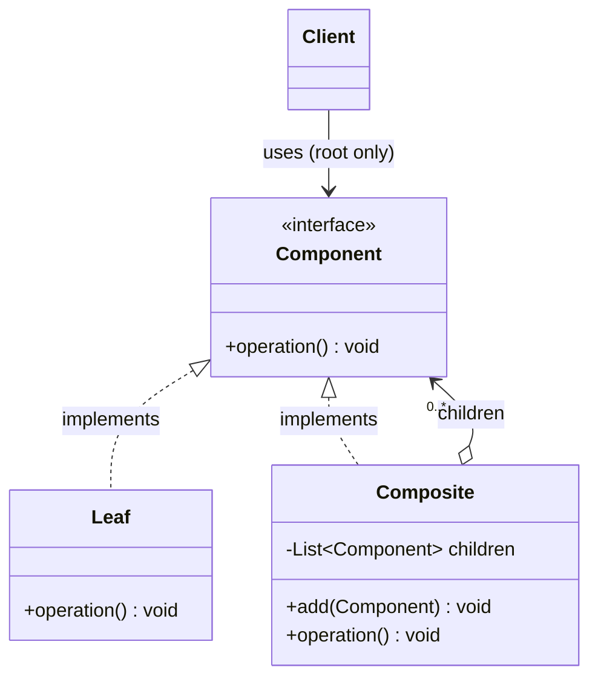
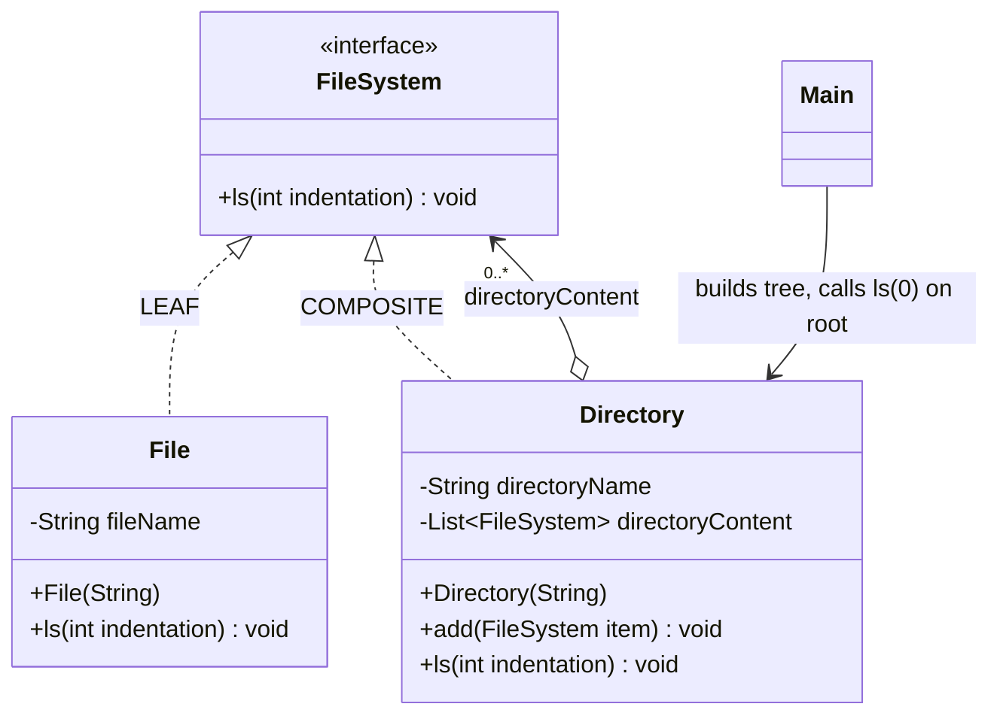
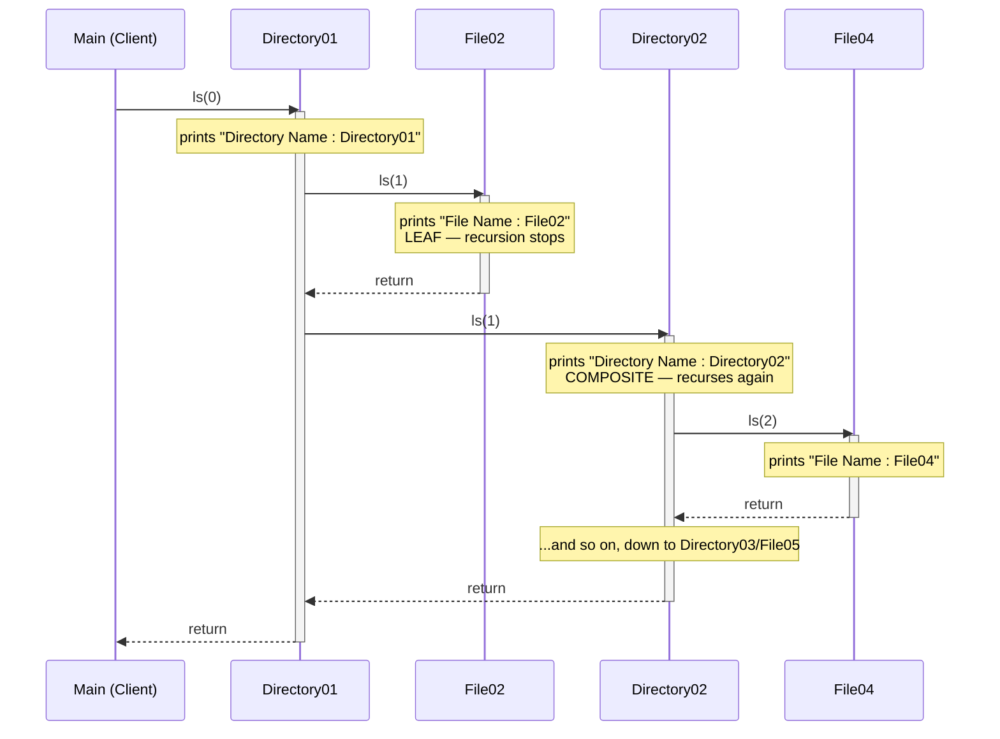
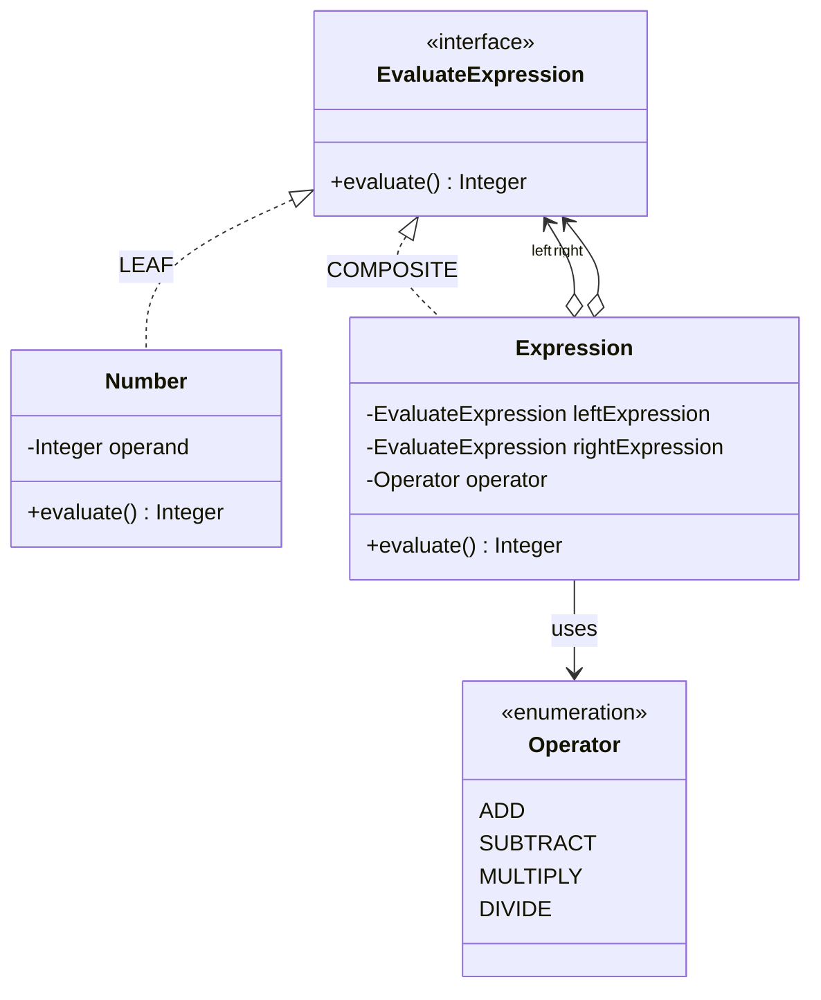

# Composite Design Pattern — UML Diagrams

Composite has the most visually distinctive structure of the structural patterns: a class that
both **implements** an interface and **holds a collection of** that same interface. That
implements-and-holds loop is what turns a flat type hierarchy into a tree of any depth.

---

## 1. The Canonical Structure



The two arrows out of `Composite` are the whole pattern:

- `Composite ..|> Component` — **"I am one."**
- `Composite o--> Component` — **"I hold many."**

Together they mean a composite can hold a composite. That's recursion, encoded in the type system.

---

## 2. This Project — `WithCompositeDesignPattern` (File System)



| Role | Class | Note |
|---|---|---|
| Component | `FileSystem` | one method: `ls(int)` |
| Leaf | `File` | prints and stops — the **base case** |
| Composite | `Directory` | prints, then delegates `ls()` to each child |
| Client | `Main` | calls `ls(0)` on the root **once** |

Note `add(FileSystem)` sits on `Directory`, **not** on `FileSystem` — the **safety** variant.
You cannot call `add()` on a `File`; the compiler stops you.

---

## 3. ASCII — the shape that matters

```
                 ┌───────────────────────────┐
                 │      «interface»          │
                 │       FileSystem          │  ◀── COMPONENT
                 │───────────────────────────│
                 │  + ls(indentation) : void │
                 └───────────────────────────┘
                       △                △
        implements     │                │     implements
              ┌────────┘                └────────┐
              │                                  │
  ┌───────────────────────┐        ┌──────────────────────────────┐
  │        File           │        │        Directory             │
  │───────────────────────│        │──────────────────────────────│
  │ - fileName : String   │        │ - directoryName : String     │
  │───────────────────────│        │ - directoryContent           │
  │ + ls(indentation)     │        │       : List<FileSystem> ────┼──┐
  └───────────────────────┘        │──────────────────────────────│  │
         LEAF                      │ + add(FileSystem) : void     │  │
    (no children —                 │ + ls(indentation) : void     │  │
     recursion stops here)         └──────────────────────────────┘  │
                                              COMPOSITE              │
                                          ▲                          │
                                          │  holds 0..* FileSystem   │
                                          └──────────────────────────┘
                                       ↑ a Directory can hold a Directory:
                                         THIS loop is the whole pattern
```

---

## 4. The Tree `Main` Builds

```
directory1.ls(0)
│
Directory01                      ← Composite
├── File02                       ← Leaf
├── File01                       ← Leaf
└── Directory02                  ← Composite (nested!)
    ├── File04                   ← Leaf
    ├── File03                   ← Leaf
    └── Directory03              ← Composite (nested deeper!)
        └── File05               ← Leaf
```

The client calls `ls()` **exactly once**, on the root. The structure walks itself.

---

## 5. Sequence — How the Recursion Unwinds



`Directory01` calls the **same method** (`ls`) on `File02` and on `Directory02`. It cannot
tell them apart, and doesn't need to. One prints; the other recurses. The `indentation`
parameter is just the recursion depth, which is why the output is a tree.

---

## 6. Variant 2 — `WithCompositeDesignPattern02` (Expression Tree)

Same pattern, **no collection** — the composite has two fixed children instead of n.



The children are typed to `EvaluateExpression`, **not** `Number` — so a sub-expression fits
anywhere a number fits. That is the *only* requirement for a Composite. A `List` is optional.

### The tree `Main` builds

```
                     expression4 (ADD)  ──▶ 76
                    /                 \
        expression2 (SUBTRACT)      expression3 (MULTIPLY)
           /          \                 /          \
  expression1 (ADD)  Number(7)    Number(8)     Number(9)
      /       \                        ⤷ 8 * 9 = 72
 Number(5)  Number(6)
      ⤷ 5 + 6 = 11        11 - 7 = 4          4 + 72 = 76
```

`evaluate()` on the root recurses to the leaves; each `Number` returns its operand
(**base case**) and each `Expression` combines its two children's results.

---

## Key Structural Points

1. **The Composite both implements and aggregates the Component.** `Directory implements
   FileSystem` *and* holds `List<FileSystem>`. That self-referential loop is the pattern —
   everything else follows from it.

2. **The collection must be typed to the Component, never the Leaf.** `List<FileSystem>`
   gives you a tree; `List<File>` gives you a flat list. One generic parameter is the
   difference between the pattern working and not existing.

3. **The Leaf is the base case.** `File.ls()` doesn't recurse, so the recursion terminates.
   Every composite tree needs leaves or it never bottoms out.

4. **The client only ever touches the root.** `Main` calls `directory1.ls(0)` — it never
   loops, never checks a type, never knows the depth. Traversal is the structure's job.

5. **A collection is not required.** `Expression` holds exactly two children and is still a
   textbook Composite. What matters is that the children are *Component-typed*.

6. **`add()` on the Composite = safety; `add()` on the Component = transparency.** This
   project chose safety — a compile error beats an `UnsupportedOperationException` on
   `File.add()`.
