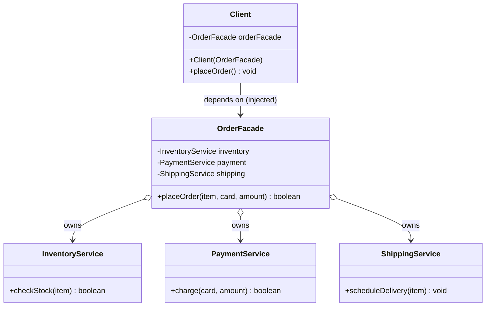
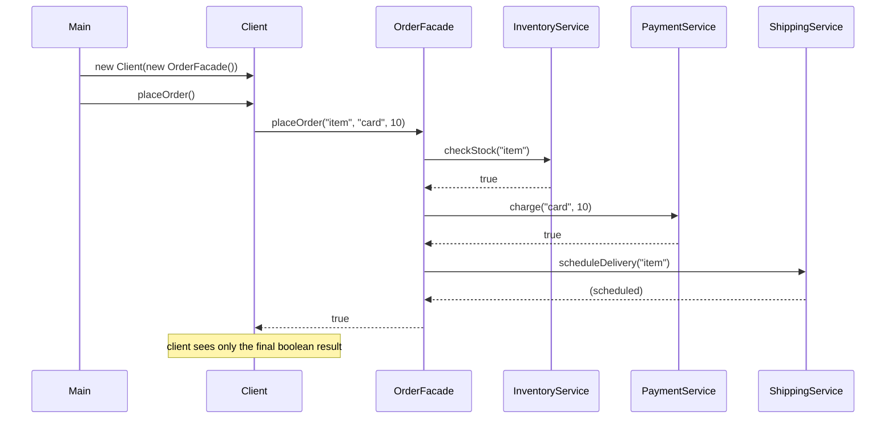
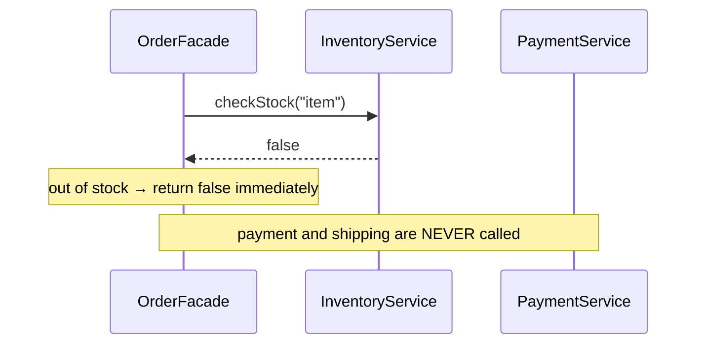

# Facade Design Pattern — UML Diagrams

UML for this project's example: a `Client` wants to place an order (one action), but
that requires coordinating three independent services — inventory, payment, shipping.
`OrderFacade` wraps all three behind a single `placeOrder(...)` method.

---

## Class Diagram (Mermaid)



**Reading the arrows:**

| Arrow | Meaning | In this example |
|---|---|---|
| `Client --> OrderFacade` | association / dependency | Client holds only the facade; sees nothing else |
| `OrderFacade o--> InventoryService` | aggregation (has-a) | Facade owns and orchestrates each subsystem service |
| (no arrows between services) | they're independent | services don't know about each other or the facade |

---

## Class Diagram (ASCII — generic GoF roles)

```
                 ┌────────────────────────┐
                 │        Client          │
                 │────────────────────────│
                 │ - orderFacade          │
                 │ + placeOrder()         │
                 └───────────┬────────────┘
                             │ depends on ONE thing
                             ▼
                 ┌────────────────────────────┐
                 │       OrderFacade          │    FACADE
                 │────────────────────────────│
                 │ - inventory                │
                 │ - payment                  │
                 │ - shipping                 │
                 │ + placeOrder(...) : boolean│  ← owns the workflow
                 └───┬──────────┬─────────┬───┘
             owns    │   owns   │   owns  │
          ┌──────────┘          │         └──────────┐
          ▼                     ▼                    ▼
 ┌──────────────────┐ ┌──────────────────┐ ┌──────────────────┐
 │ InventoryService │ │  PaymentService  │ │ ShippingService  │  SUBSYSTEM
 │──────────────────│ │──────────────────│ │──────────────────│
 │ + checkStock()   │ │ + charge()       │ │ + scheduleDeliv. │
 └──────────────────┘ └──────────────────┘ └──────────────────┘
   (independent, unaware of each other and of the facade)
```

---

## Sequence Diagram (Mermaid)



**Failure short-circuit** (what the guards buy you):



---

## Key Structural Points

1. **The client depends on exactly one class.** `Client` holds only `OrderFacade`;
   the three subsystem classes never appear in its code. That single dependency is
   the payoff of the pattern.

2. **The facade *owns the workflow*, not just references.** The real value is that the
   step order (check → charge → ship) and the failure rules live inside `placeOrder`,
   in one place — callers can't get the sequence wrong.

3. **Subsystem classes are independent and unaware.** `InventoryService`,
   `PaymentService`, and `ShippingService` have no arrows between them and no knowledge
   of the facade — they stay reusable and independently testable.

4. **Adding a step grows the facade, not the client.** A new `NotificationService`
   would appear as a fourth `o-->` from `OrderFacade` and one more line inside
   `placeOrder` — `Client` stays untouched (Open/Closed).
