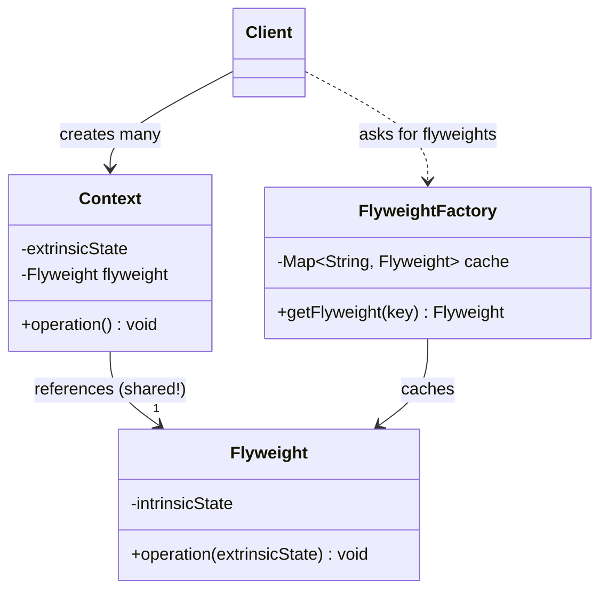
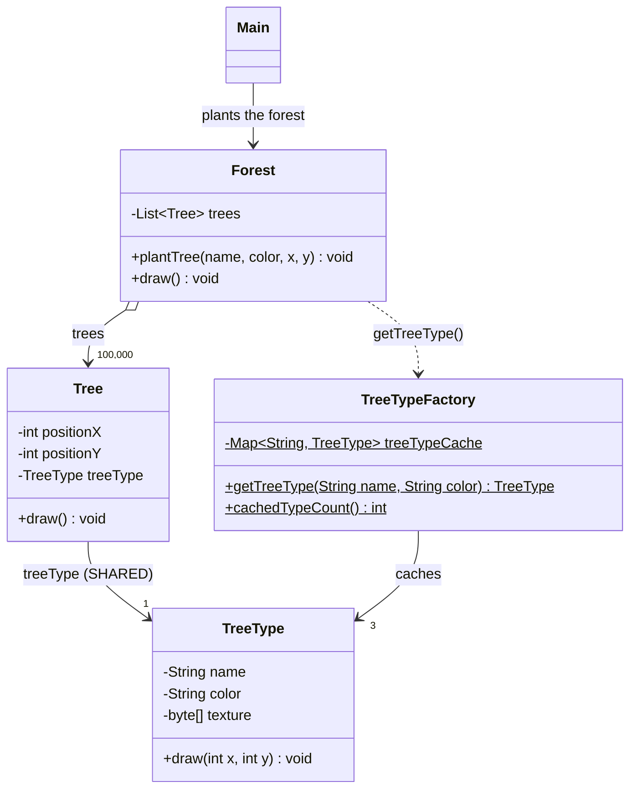
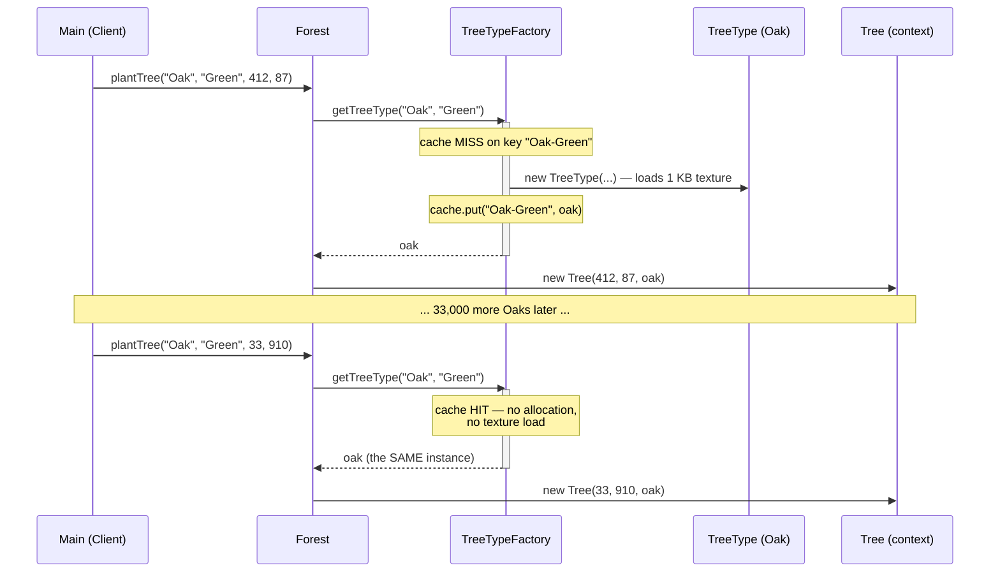
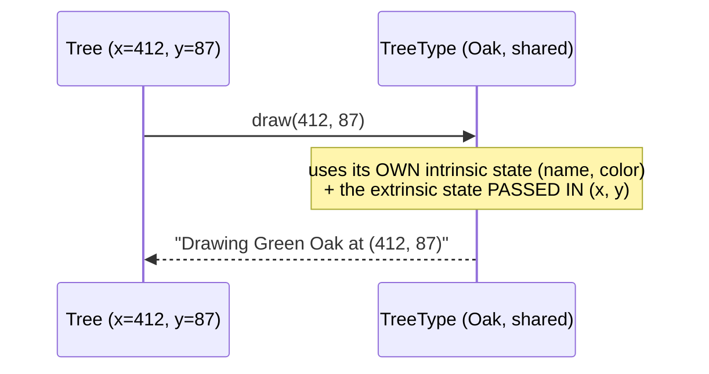
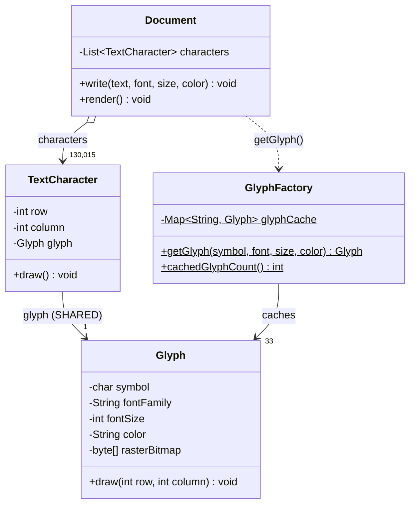

# Flyweight Design Pattern — UML Diagrams

The structural signature of Flyweight is a **many-to-one arrow**: thousands of Context objects
pointing at a handful of Flyweight objects, with a Factory standing in the doorway making sure
nobody creates a duplicate.

---

## 1. The Canonical Structure



Read the two arrows into `Flyweight`:

- `Context --> Flyweight` — **many** contexts, pointing at the **same** object.
- `FlyweightFactory --> Flyweight` — the factory owns the cache; it is the **only** way to get one.

---

## 2. This Project — `WithFlyweightDesignPattern` (Forest)



| Role | Class | Holds |
|---|---|---|
| **Flyweight** | `TreeType` | name, color, texture — **intrinsic**, `final`, 3 instances |
| **Flyweight Factory** | `TreeTypeFactory` | the `HashMap` cache — guarantees sharing |
| **Context** | `Tree` | positionX, positionY — **extrinsic**, 100,000 instances |
| **Client** | `Forest` / `Main` | builds contexts, never `new`s a flyweight |

---

## 3. ASCII — Where the Memory Goes

```
  WITHOUT FLYWEIGHT                          WITH FLYWEIGHT
  ─────────────────                          ──────────────

  Tree #1                                    Tree #1  ──┐
  ├ name    : "Oak"                          ├ x : 412  │
  ├ color   : "Green"                        └ y : 87   │
  ├ texture : [1 KB] ⚠                                  │
  ├ x       : 412                            Tree #2  ──┤
  └ y       : 87                             ├ x : 33   │
                                             └ y : 910  │
  Tree #2                                               │      ┌──────────────────────┐
  ├ name    : "Oak"      ⚠ duplicated        Tree #3  ──┼─────▶│      TreeType        │
  ├ color   : "Green"    ⚠ duplicated        ├ x : 780  │      │──────────────────────│
  ├ texture : [1 KB]     ⚠ duplicated        └ y : 4    │      │ name    : "Oak"      │
  ├ x       : 33                                        │      │ color   : "Green"    │
  └ y       : 910                            ... 33,000 │      │ texture : [1 KB]     │
                                             more Trees─┘      │  (final — immutable) │
  ... × 100,000                                                └──────────────────────┘
                                                                   ONE instance,
  100,000 × 1 KB = 103 MB                                       shared by all Oaks
                                                              (+ 1 for Pine, 1 for Maple)

                                                              100,000 × 8-byte pointer = 2 MB
```

The `Tree` objects don't disappear — there are still 100,000 of them. They just shrink from
"1 KB + fields" to "two ints and a pointer".

---

## 4. Sequence — The Factory Doing Its Job



The texture is loaded on the **first** Oak and never again. Every subsequent Oak is a cache hit —
that's the `Textures loaded : 3` in the output.

---

## 5. The Draw Call — Extrinsic State Flows *In*



This is the crux. `TreeType.draw()` **must** take the position as a parameter, because the
object is shared by 33,000 trees and therefore has no position of its own. **A flyweight cannot
know where it is** — the context has to tell it, on every call.

---

## 6. Variant 2 — `WithFlyweightDesignPattern02` (Word Processor)

The original GoF example. Same four roles, different domain — and a much higher sharing ratio.



| Role | Class | Count at runtime |
|---|---|---|
| **Flyweight** | `Glyph` | **33** (symbol + font + size + colour) |
| **Flyweight Factory** | `GlyphFactory` | 1 (static cache) |
| **Context** | `TextCharacter` | **130,015** (row + column + reference) |
| **Client** | `Document` / `Main` | — |

### The sharing, drawn out

```
   Document: "The flyweight pattern shares..." × 2000
   ─────────────────────────────────────────────────

   TextCharacter(0,0) ─┐
   TextCharacter(1,7) ─┤                    ┌─────────────────────────┐
   TextCharacter(1,22)─┼───────────────────▶│        Glyph            │
   TextCharacter(2,7) ─┤                    │─────────────────────────│
        ...            │                    │ symbol       : 'e'      │
   ~6,000 more 'e's  ──┘                    │ fontFamily   : "Times"  │
                                            │ fontSize     : 12       │
   every 'e' in the body is                 │ color        : "Black"  │
   THE SAME OBJECT                          │ rasterBitmap : [512 B]  │
                                            └─────────────────────────┘
                                                  ONE instance

   ⚠ but 'e' in the HEADING (Arial 24pt Red) is a DIFFERENT flyweight —
     font, size and colour are all intrinsic, so a different tuple
     means a different object.
```

That last point is the one people get wrong. The cache key is the **whole intrinsic tuple**
(`symbol-font-size-color`), not the character. `'e'` is not one flyweight; `'e' in Times 12 Black`
is one flyweight.

---

## Key Structural Points

1. **The split is the pattern.** Intrinsic (shared, immutable) goes in the Flyweight; extrinsic
   (unique) stays in the Context. Get the split right and the rest is bookkeeping.

2. **Extrinsic state is passed as method arguments, never stored on the flyweight.** If
   `TreeType` had an `x` field, sharing would be broken and every tree would fight over it.

3. **The Factory is not optional.** It's the *guarantee* of sharing. `TreeType`'s constructor is
   package-private to steer clients through the cache — put the flyweight in its own package and
   that becomes a compile-time guarantee rather than a convention.

4. **Flyweight fields are `final`.** Shared state that can mutate is a bug factory — one write
   changes the world for thousands of unrelated holders.

5. **The cache key must cover every intrinsic field** (`name + "-" + color`), or two genuinely
   different flyweights collide into one.

6. **Contexts are still numerous.** 100,000 `Tree` objects remain. Flyweight makes each one
   *small*; it does not make them *fewer*.
