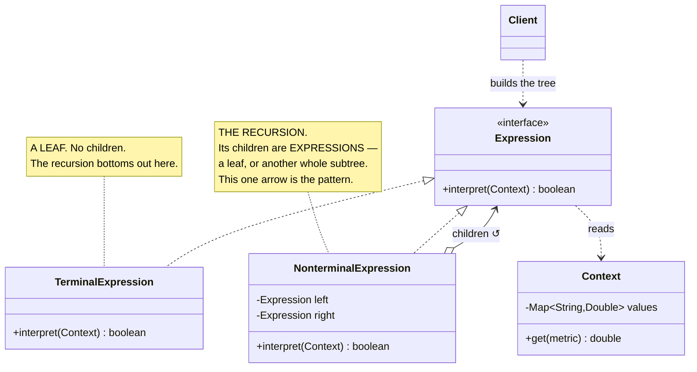
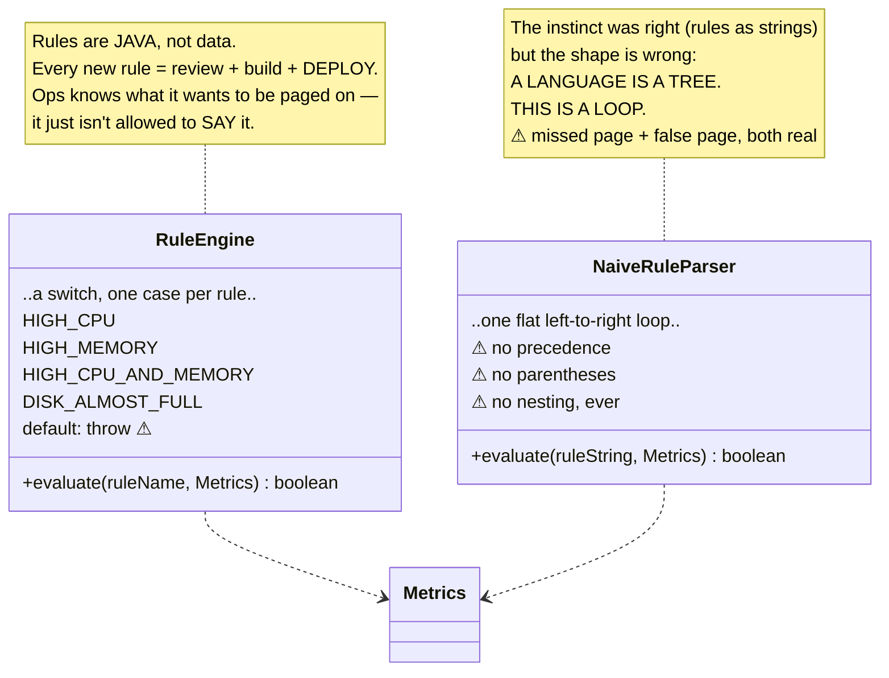
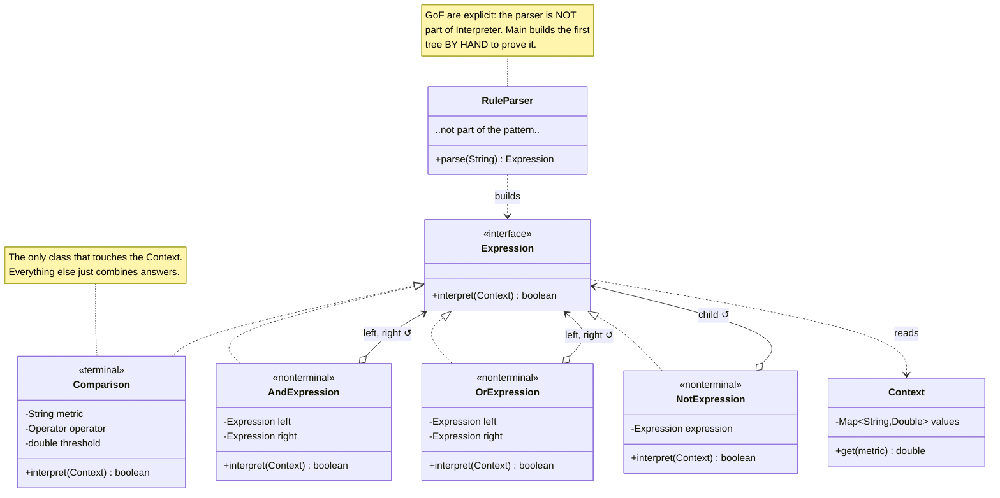
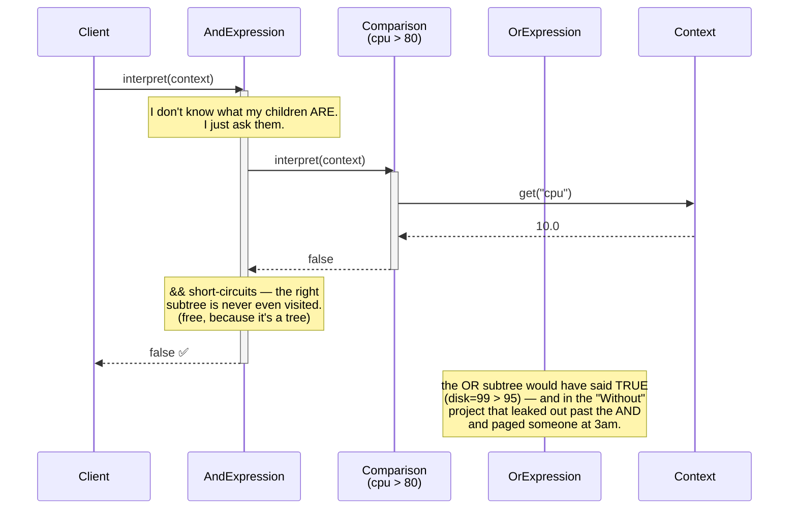

# Interpreter Design Pattern — UML Diagrams

Interpreter has one structural idea, and every diagram below is a restatement of it:

> **The grammar becomes the class hierarchy. A sentence becomes a tree of objects.**

The thing to watch for is the arrow that a nonterminal points *at itself* — `AndExpression` holds two
`Expression`s, and one of those might be another `AndExpression`. That self-reference is the pattern.
It's also the one thing a flat loop can never have.

---

## 1. The Canonical Structure



---

## 2. The Problem — `WithoutInterpreterDesignPattern`



There is no self-referencing arrow anywhere on this diagram. **That absence is the bug.** Neither
class has any way to say "and here, another whole expression goes."

---

## 3. The Fix — `WithInterpreterDesignPattern`



| Grammar rule | Class | Role |
|---|---|---|
| `expression := term ("OR" term)*` | `OrExpression` | NonterminalExpression |
| `term := factor ("AND" factor)*` | `AndExpression` | NonterminalExpression |
| `factor := "NOT" factor \| "(" expression ")"` | `NotExpression` | NonterminalExpression |
| `comparison := metric (">" \| "<") number` | `Comparison` | **TerminalExpression** |
| — | `Context` | Context |
| — | `Main` / `RuleParser` | Client |

**One class per grammar rule.** That table *is* the pattern.

---

## 4. ASCII — Why the Tree Wins

The rule:  `cpu > 50 OR memory > 95 AND disk > 99`
Metrics:   `cpu=60, memory=10, disk=10`

```
   WITHOUT — a flat LOOP                    WITH — a TREE
   ─────────────────────                    ────────────

   fold left to right:                                    ┌──────────┐
                                                          │    OR    │  ← shallow: binds loosely
   [cpu>50] ──OR──► true                                  └────┬─────┘
        │                                              ┌───────┴───────┐
        ▼                                              ▼               ▼
   [memory>95] ──► false                        ┌────────────┐   ┌──────────┐
        │                                       │  cpu > 50  │   │   AND    │ ← DEEPER:
        │  true OR false = true                 │ (terminal) │   └────┬─────┘   binds tighter
        ▼                                       └────────────┘   ┌────┴────┐
   [disk>99] ──► false                                 true      ▼         ▼
        │                                                  ┌──────────┐ ┌────────┐
        │  true AND false = FALSE  ⚠                       │memory>95 │ │disk>99 │
        ▼                                                  └──────────┘ └────────┘
     FALSE  ← the CPU is at 60%.                              false        false
             Nobody gets paged.                                   └────┬────┘
                                                                   false
                                                                       │
   The loop can only ever go                                    true OR false
   ────────────────────────────                                        │
   left → right → left → right                                       TRUE  ✅
   It has no way to say
   "a whole expression goes here."          interpret() recurses. Deeper = evaluated first.
                                            PRECEDENCE IS NOT CODE — IT'S THE SHAPE.
```

**There is no precedence table in the "With" project.** Not one. "AND binds tighter than OR" is not a
rule the evaluator applies — it is the observation that **AND nodes sit deeper**, and recursion reaches
the bottom first.

Parentheses are the same trick from the other direction: `factor()` sees `(` and restarts the grammar
from the top, nesting a subtree in place. **A bracket was never anything more than "a subtree goes
here."**

The "Without" evaluator had to get precedence right on *every single evaluation*, and got it wrong.
The "With" version settles the shape **once**, at parse time, and after that it is a structural fact
about the object graph.

---

## 5. Sequence — Interpreting One Rule

`cpu > 80 AND ( memory > 90 OR disk > 95 )` against `cpu=10, memory=10, disk=99`



The short-circuit is a nice bonus that falls out of the structure: because the right operand is a
subtree rather than a value that was already computed, **it is never evaluated at all**. A flat
left-to-right fold computes every comparison whether it needs to or not.

---

## Key Structural Points

1. **One class per grammar rule.** Write the grammar, count the productions, that's your class list.
   If you can't write the grammar down, you're not ready to write the interpreter.

2. **Nonterminals hold `Expression`, not `boolean`.** This single field type is the whole pattern.
   It's what allows a child to be a leaf *or* a fifty-node subtree, and it's what the "Without"
   project structurally could not express.

3. **Terminals are where recursion stops.** `Comparison` is the only class that reads the `Context`.
   Every other class just combines answers from its children.

4. **Precedence and parentheses are not implemented — they're the shape of the tree.** Decided once at
   construction, not re-derived on every evaluation. Print the tree (`toString()`) and most precedence
   bugs become visible instantly.

5. **The Context keeps the tree stateless.** The expression knows nothing about any particular server,
   so one parsed rule can be interpreted against the whole fleet.

6. **The parser is not part of the pattern.** GoF are explicit. `Main` builds its first tree by hand
   with `new OrExpression(...)` to make that concrete.

7. **The tree is a Composite; the next step is a Visitor.** Interpreter puts `interpret()` on the node,
   which is right for **one** operation. When you want many operations over the same tree — evaluate,
   type-check, optimise, pretty-print — move them out into visitors. That is exactly the road every
   real compiler travels. See `CompositeDesignPattern/` and `VisitorDesignPattern/`.
