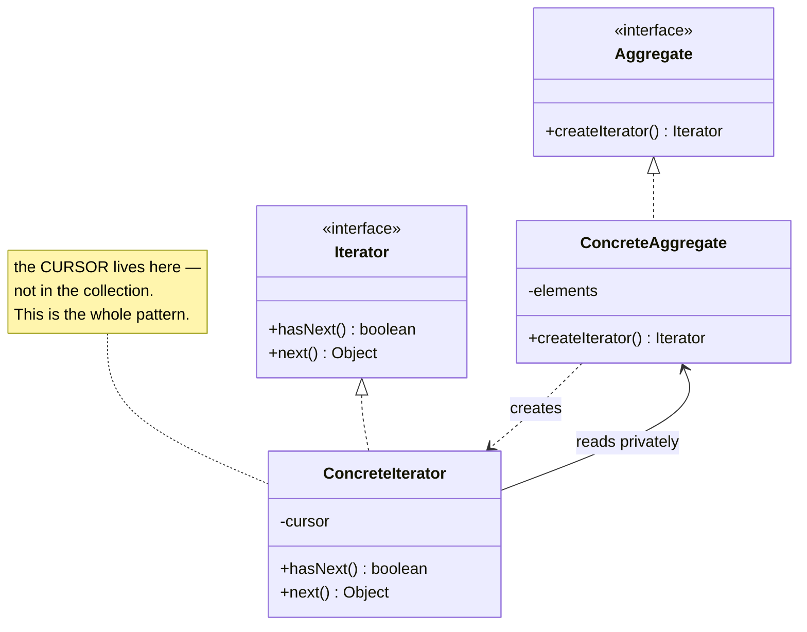
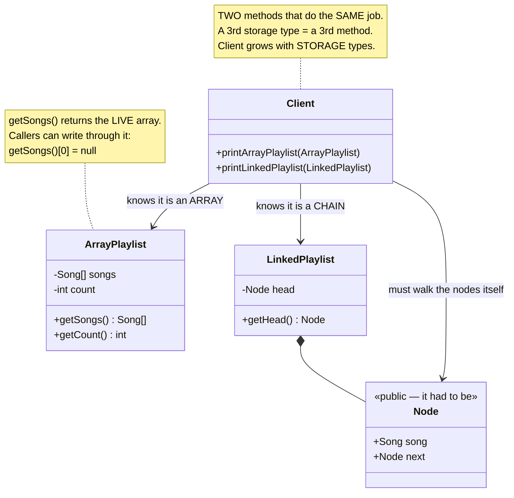
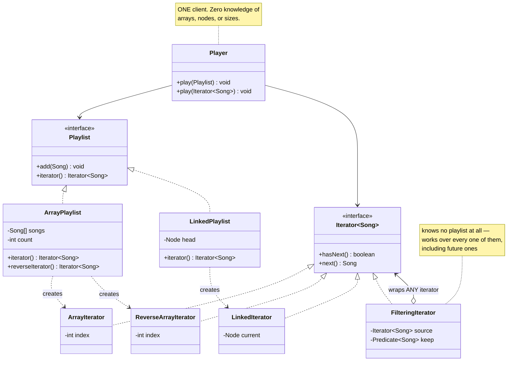
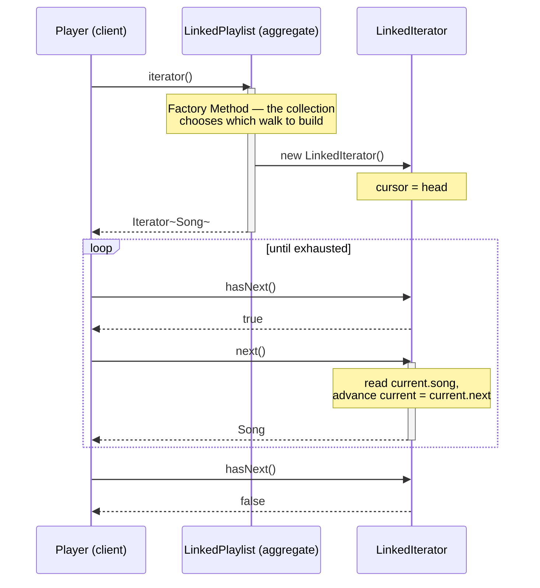

# Iterator Design Pattern — UML Diagrams

Iterator's structure is two small parallel hierarchies — **collections** and **walks over
collections** — joined by one factory method.

The thing to look for in the diagrams below is where the **cursor** lives. That is the entire
pattern, and it is one field.

---

## 1. The Canonical Structure



`createIterator()` is a **Factory Method**: the collection decides which walk to build. In Java these
are spelled `Iterable.iterator()` and `java.util.Iterator`.

---

## 2. The Problem — `WithoutIteratorDesignPattern`



The client has an arrow to the *internals* of both collections. That is the disease; the duplicated
loop is only the symptom.

---

## 3. The Fix — `WithIteratorDesignPattern`



**Note the arrows the client does *not* have.** `Player` reaches nothing but two interfaces. The
array and the `Node` chain are now unreachable from outside.

| Role | This project |
|---|---|
| **Iterator** | `java.util.Iterator<Song>` |
| **Concrete Iterator** | `ArrayIterator`, `ReverseArrayIterator`, `LinkedIterator`, `FilteringIterator` |
| **Aggregate** | `Playlist` (extends `Iterable<Song>`) |
| **Concrete Aggregate** | `ArrayPlaylist`, `LinkedPlaylist` |

---

## 4. ASCII — Where the Cursor Lives

```
   WITHOUT ITERATOR                        WITH ITERATOR
   ────────────────                        ─────────────

   ┌──────────────────┐                    ┌──────────────────┐
   │  ArrayPlaylist   │                    │  ArrayPlaylist   │
   │  ───────────────  │                    │  ───────────────  │
   │  Song[] songs    │                    │  Song[] songs    │  ← private, always
   │  int    count    │                    │  int    count    │
   │                  │                    └────────┬─────────┘
   │  getSongs()  ────┼──▶ leaks                    │ creates
   └────────┬─────────┘                             ▼
            │                              ┌──────────────────┐  ┌──────────────────┐
            ▼                              │  ArrayIterator   │  │  ArrayIterator   │
   ┌──────────────────┐                    │  int index = 2   │  │  int index = 0   │
   │      Client      │                    └──────────────────┘  └──────────────────┘
   │  ──────────────  │                       "ahead"               "behind"
   │  knows it's an   │                              ▲   ▲
   │  ARRAY. Writes   │                               ╲ ╱
   │  the loop itself │                                │
   │                  │                        ┌──────────────┐
   │  + a 2nd loop    │                        │    Player    │  ← ONE method
   │    for the chain │                        │  play(...)   │     for every
   └──────────────────┘                        └──────────────┘     collection


   cursor: in the CLIENT's loop            cursor: in the ITERATOR
   → one walk at a time                    → as many simultaneous walks as you like
   → client grows with STORAGE types       → client never changes
```

The naive fix — putting a `currentIndex` field on the *playlist* — looks like it hides the array, and
it does. But it also makes two simultaneous walks **impossible**, because there is only one position
to go around. Moving the cursor into a separate object is what buys both encapsulation *and*
concurrent traversal, and it is the reason the iterator is a class rather than a method.

---

## 5. Sequence — `for (Song s : playlist)`



This is not a diagram of some framework you might one day use. **This is what the Java compiler
generates for every enhanced `for` loop you write.** The client asks; it never reaches in. Iterator
is a **pull** protocol — which is exactly what separates it from Observer, where the subject pushes.

---

## Key Structural Points

1. **The cursor lives in the iterator, not in the collection.** One field, and everything else
   follows from it. If you find a `currentIndex` on the collection, the pattern is not there.

2. **Two iterators over one collection do not interfere.** They are two objects with two positions.
   The nested-loop / compare-every-pair traversal is only possible because of this.

3. **`createIterator()` is a Factory Method.** The concrete aggregate chooses the concrete iterator.
   The client is handed an interface and never learns which one it got.

4. **The client's arrows stop at the interfaces.** `Player` touches `Playlist` and `Iterator` and
   nothing else — no array, no `Node`, no `count`. That is the intent sentence ("without exposing its
   underlying representation") drawn as a diagram.

5. **Iterators compose.** `FilteringIterator` wraps *any* `Iterator`, so it works over the array, the
   chain, the reversed array, and collections that don't exist yet. This is the seed of
   `java.util.stream`.

6. **In Java, the Aggregate role is `Iterable` and the Iterator role is `java.util.Iterator`.**
   Implement those two and the language hands you the for-each loop. Roll your own interface and you
   get the pattern but lose the syntax — which is almost always the wrong trade outside of learning.
