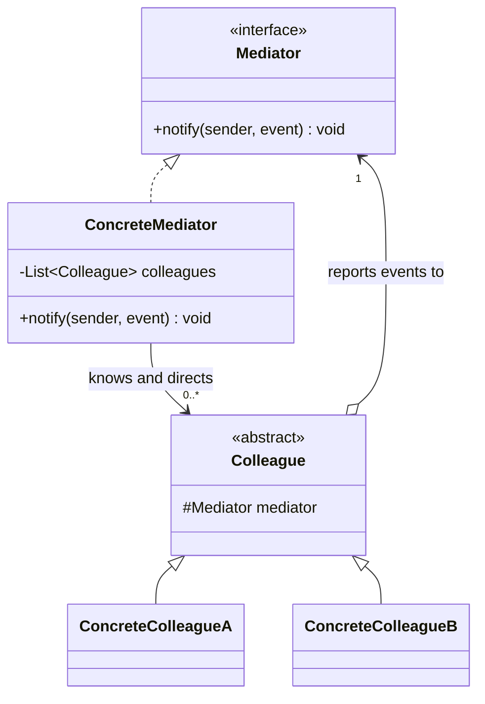
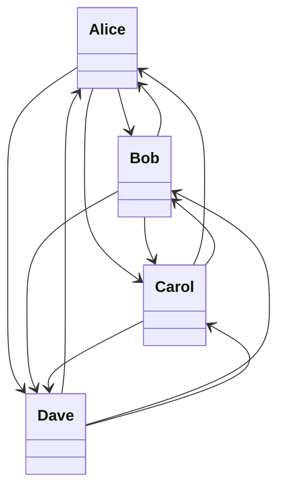
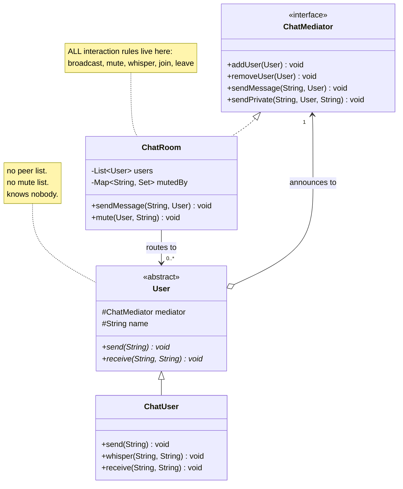
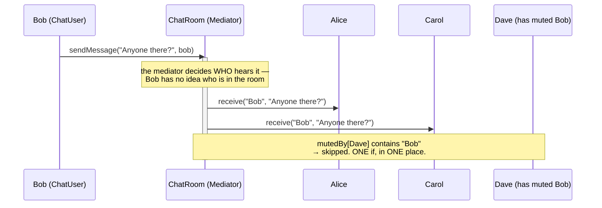

# Mediator Design Pattern — UML Diagrams

The structural signature of Mediator is the clearest of any pattern, because it is literally a
**change of shape**: a **mesh** becomes a **star**.

If you can see the mesh in your object graph, you have found the problem. The pattern is just the
act of putting something in the middle.

---

## 1. The Canonical Structure



Read the two arrows between the hierarchies — the relationship is **bidirectional**, and that is the
whole pattern:

- **Colleague → Mediator**: "this happened." The colleague *announces*.
- **Mediator → Colleague**: "then do this." The mediator *directs*.

Colleagues have **no arrow to each other**. That absence is the point.

---

## 2. The Problem — `WithoutMediatorDesignPattern`



**Twelve arrows for four objects.** `n × (n-1)`. Every user holds a `List<User> peers` containing
everyone else, plus its own copy of the mute policy. Add a fifth and you draw eight more arrows.

That diagram is not a strawman — it is a faithful drawing of the code.

---

## 3. The Fix — `WithMediatorDesignPattern`



| Role | Class |
|---|---|
| **Mediator** | `ChatMediator` |
| **Concrete Mediator** | `ChatRoom` |
| **Colleague** | `User` |
| **Concrete Colleague** | `ChatUser` |

---

## 4. ASCII — Mesh Becomes Star

```
   WITHOUT MEDIATOR                        WITH MEDIATOR
   ────────────────                        ─────────────

    Alice ◀────────▶ Bob                    Alice        Bob
      ▲ ╲          ╱ ▲                          ╲       ╱
      │  ╲        ╱  │                           ╲     ╱
      │   ╲      ╱   │                            ▼   ▼
      │    ╲    ╱    │                        ┌──────────┐
      │     ╲  ╱     │                        │ ChatRoom │
      │      ╳       │                        │(mediator)│
      │     ╱  ╲     │                        └──────────┘
      │    ╱    ╲    │                            ▲   ▲
      ▼   ╱      ╲   ▼                           ╱     ╲
    Dave ◀────────▶ Carol                       ╱       ╲
                                            Carol        Dave

     12 connections                          4 connections
     n × (n-1)  → quadratic                  n  → linear

     add Erin: +8 connections,               add Erin: +1 connection,
     touch all 4 existing users              touch NOBODY

     mute rule: in all 4 users               mute rule: in 1 place
```

The mesh is not just ugly — it is *unownable*. Nobody is responsible for it, so the rules that govern
it end up scattered among the participants. The star gives the interaction an **owner**.

---

## 5. Sequence — Announce, Don't Route



Compare with the "Without" version, where **Bob's `send()` loops over Bob's peer list and reaches
into Dave's private mute list to decide whether Dave should hear him.** The rule is Dave's, but the
sender enforces it. That inversion is what a mediator fixes.

Bob's entire job is now one line: `mediator.sendMessage(message, this)`. He announces. He does not
route.

---

## Key Structural Points

1. **Colleagues have no reference to each other.** If `ChatUser` had a `List<ChatUser>`, the pattern
   is not there — whatever else you built. This is the one check that matters.

2. **The relationship is bidirectional.** Colleague → mediator ("this happened"), mediator →
   colleague ("do this"). A one-way wrapper over a subsystem is a **Facade**, not a Mediator.

3. **`n × (n-1)` becomes `n`.** Quadratic coupling becomes linear. That's the measurable win, and the
   easiest way to spot the need for the pattern in an existing codebase.

4. **All interaction policy lives in the mediator.** Broadcast rules, mute, whisper, join, leave.
   Adding `whisper()` required no change to any colleague — a new *interaction* is a mediator change
   by definition.

5. **Colleagues announce; they do not route.** `mediator.sendMessage(message, this)` — the sender
   passes itself and the event, then stops thinking. Who receives it is not its business.

6. **⚠ The mediator is where the complexity now lives.** You moved it, you didn't delete it. Watch
   `ChatRoom` for God-Object growth — that is this pattern's characteristic failure, not a
   hypothetical one.
