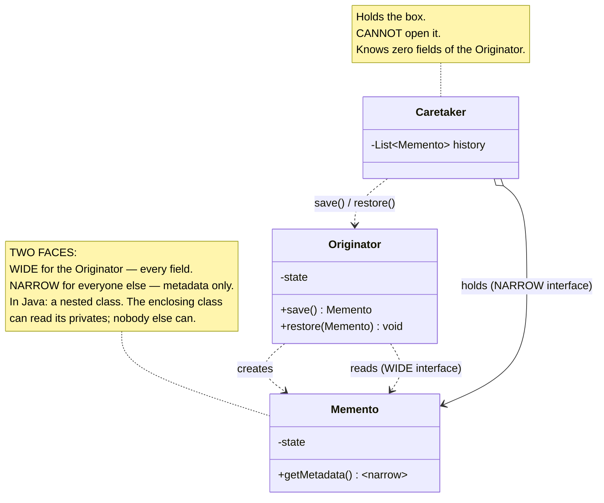
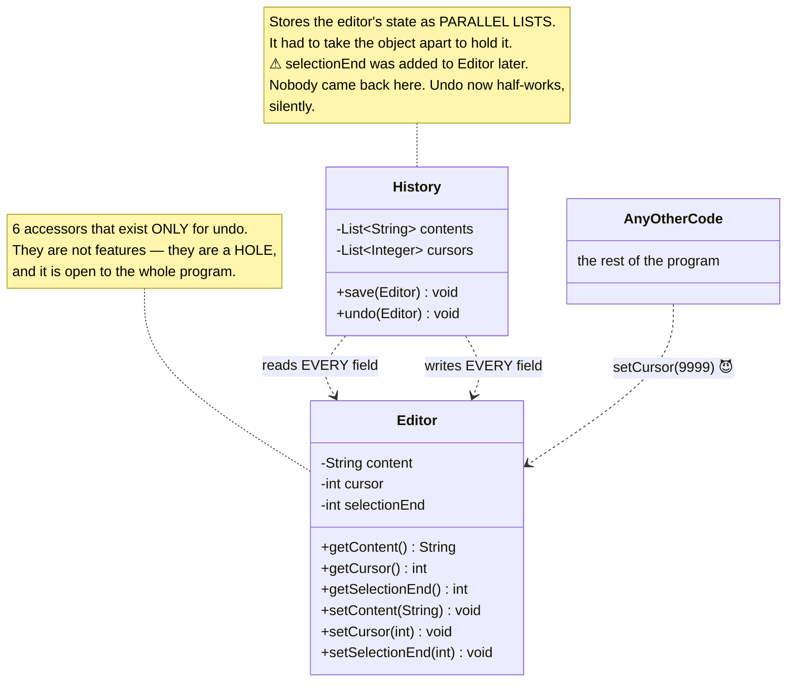
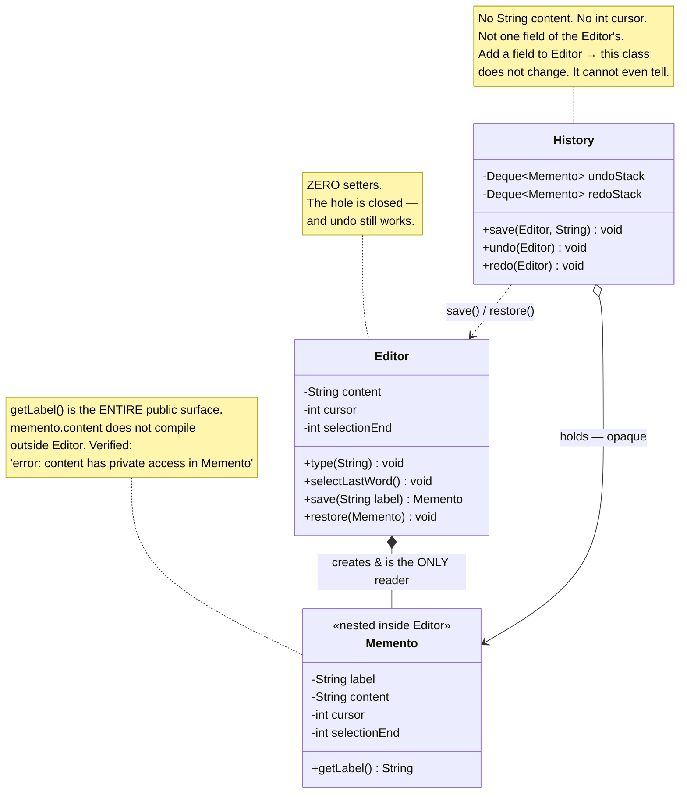
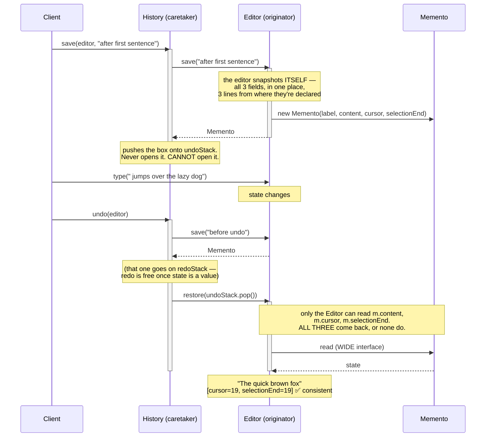

# Memento Design Pattern — UML Diagrams

Memento is three objects and one rule.

The three objects are the **Originator** (has the state), the **Memento** (holds a copy of it) and
the **Caretaker** (keeps the mementos). The rule is: **the caretaker never opens the box.**

The thing to look for in the diagrams below is which arrows point *into* the originator's state. In
the "Without" version there are many. In the fix there are none.

---

## 1. The Canonical Structure



The two arrows from `Originator` to `Memento` are the pattern: it **creates** the box and it is the
only thing that can **read** it. The caretaker's arrow is a `holds` and nothing more.

---

## 2. The Problem — `WithoutMementoDesignPattern`



Two separate failures, and they share one cause — the state was pulled *out* of the object:

- **the hole**: `setCursor()` was added for undo, but it is public, so anyone can put the editor into
  a state it could never reach by typing;
- **the silent bug**: `History` enumerates the editor's fields by hand, so it can forget one — and
  did.

---

## 3. The Fix — `WithMementoDesignPattern`



| Role | This project |
|---|---|
| **Originator** | `Editor` |
| **Memento** | `Editor.Memento` (nested, immutable) |
| **Caretaker** | `History` |

---

## 4. ASCII — Who Can See the State?

```
   WITHOUT MEMENTO                          WITH MEMENTO
   ───────────────                          ────────────

   ┌───────────────────────┐                ┌───────────────────────┐
   │       Editor          │                │       Editor          │
   │  ───────────────────  │                │  ───────────────────  │
   │  content              │                │  content              │
   │  cursor          ┌────┼── get ──┐      │  cursor               │  ← private. Full stop.
   │  selectionEnd    │    │         │      │  selectionEnd         │
   │                  └────┼── set ──┤      │                       │
   │  ⚠ 6 accessors        │         │      │  save()    ──────┐    │
   │    cut into the class │         │      │  restore(m) ◀──┐ │    │
   └───────────────────────┘         │      └────────────────┼─┼────┘
              ▲                      │                       │ │
              │ setCursor(9999)      ▼                       │ ▼
   ┌──────────┴─────────┐   ┌────────────────┐               │  ┌──────────────────┐
   │  ANY code at all   │   │    History     │               │  │     Memento      │
   │  can corrupt it 😈 │   │  ────────────  │               │  │  ──────────────  │
   └────────────────────┘   │ List<String>   │               │  │  content         │
                            │ List<Integer>  │               │  │  cursor          │
                            │ ⚠ forgot       │               │  │  selectionEnd    │
                            │   selectionEnd │               │  │  ─────────────   │
                            └────────────────┘               │  │  getLabel() ← ALL
                                                             │  │   anyone else gets
                            History KNOWS the fields.        │  └────────┬─────────┘
                            It has to. That's why it         │           │ holds, opaque
                            can forget one.                  │           ▼
                                                             │  ┌──────────────────┐
                                                             └──│     History      │
                                                                │  ──────────────  │
                                                                │ Deque<Memento>   │
                                                                │ Deque<Memento>   │
                                                                │                  │
                                                                │ knows NOTHING    │
                                                                │ about Editor's   │
                                                                │ fields           │
                                                                └──────────────────┘

   state is pulled OUT of the object          the object copies ITSELF into a sealed box
   → the object must be opened up             → the object stays closed
   → the copier can forget a field            → forgetting a field is impossible
```

**The whole pattern is the direction of that copy.** In the "Without" design the caretaker *pulls*
state out, so the editor must open up and the caretaker must know the fields. In the fix the editor
*pushes* a copy of itself into a box, so it stays closed and nobody else ever needs to know what's
inside.

---

## 5. Sequence — Type, Snapshot, Undo



Compare the last note with the "Without" run, where the same undo produced
`[cursor=19, selectionEnd=43]` — a document 19 characters long with a selection running to
character 43.

---

## Key Structural Points

1. **The originator snapshots itself.** That single reversal is the pattern. State and the code that
   captures it live in the same class, so a field cannot be forgotten — the way `History` forgot
   `selectionEnd` in the "Without" project.

2. **Restore is all-or-nothing.** The caretaker hands the whole box back; it cannot restore two
   fields out of three, because it cannot see fields at all. Partial restore isn't discouraged here —
   it's **unrepresentable**.

3. **Wide interface for the originator, narrow for everyone else.** In Java a nested class gives you
   this with no ceremony: the enclosing class reads its privates, and nobody else can — verified,
   not assumed:
   `error: content has private access in Memento`.

4. **The caretaker holds values, not fields.** `History` has no `String content` and no `int cursor`.
   Add a field to `Editor` and `History` doesn't change; it cannot even detect that anything did.

5. **The memento is immutable and dead.** All fields `final`, no setters — a snapshot that can be
   edited after the fact is not a snapshot. And unlike a Prototype's clone, it is not a usable
   object: you cannot type into a `Memento`. Its only purpose is to be handed back.

6. **Zero setters on the originator.** This is the acceptance test for the pattern. If your
   originator still has a setter that exists "for undo", the hole is still open and you have written
   the "Without" project with more classes.
