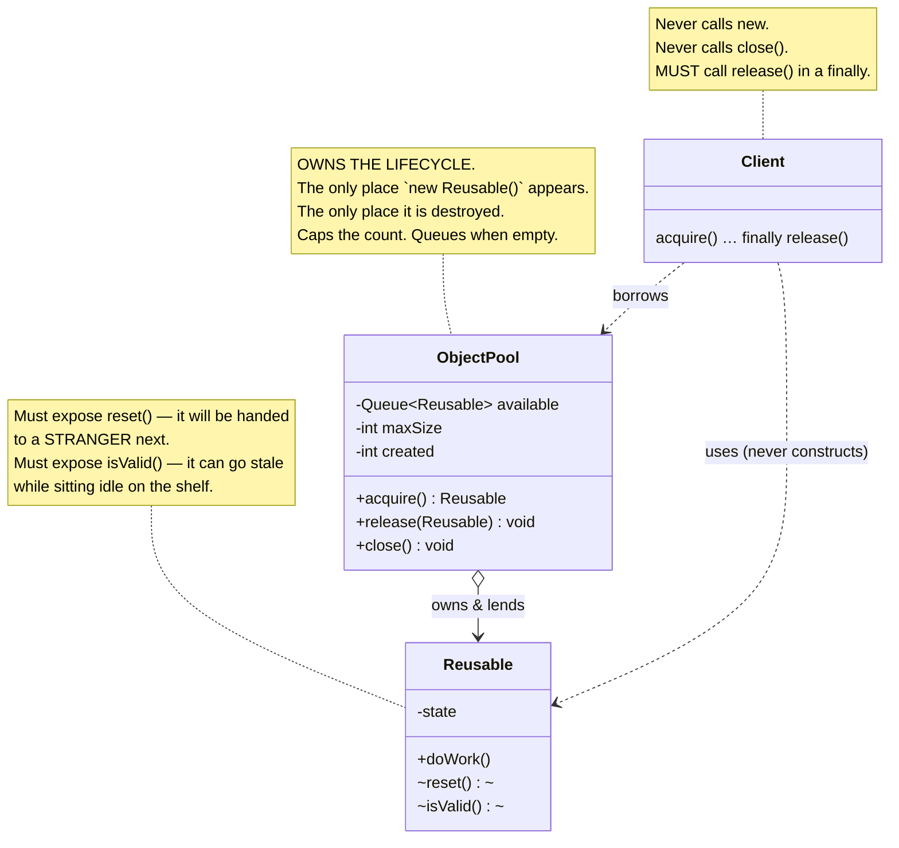
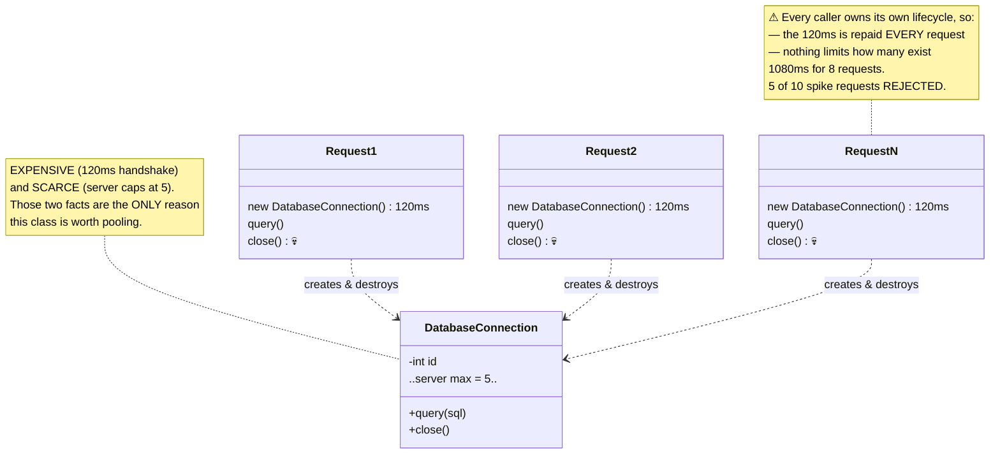
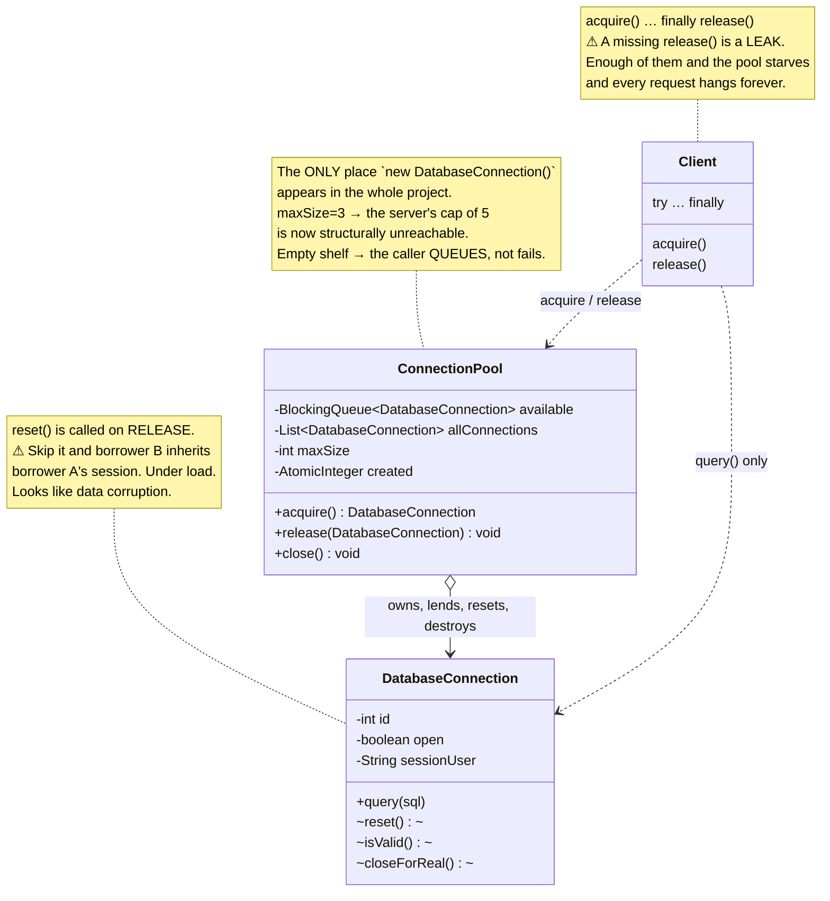
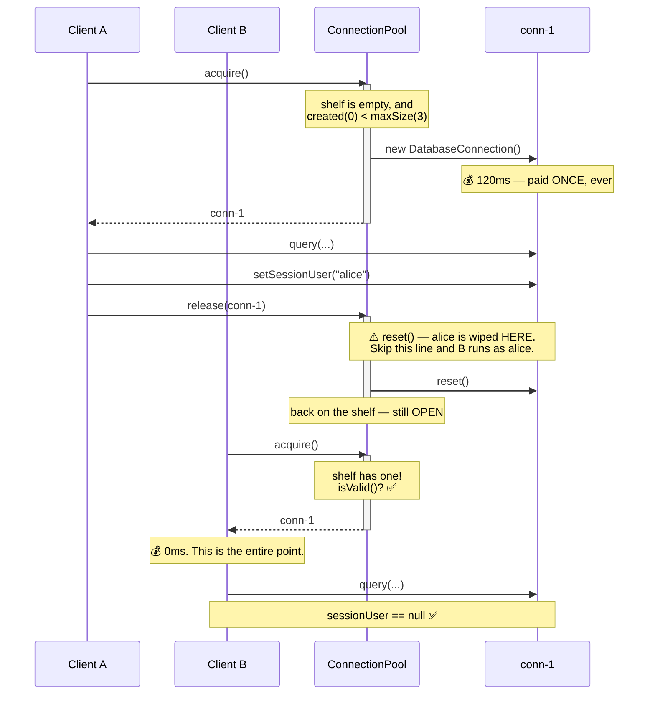

# Object Pool Design Pattern — UML Diagrams

**⚠ Not a GoF pattern.** It isn't in *Design Patterns* (1994) — it comes from the resource-management
literature. Worth knowing if anyone quizzes you on the 23.

The structure is small. What matters is a single question, and every diagram below is a way of asking
it:

> **Who calls `new`, and who calls `close()`?**

In the "Without" version, every caller does. In the fix, exactly one object does — and that relocation
is the entire pattern.

---

## 1. The Canonical Structure



The arrow that isn't here is the one that mattered: **`Client ..> new Reusable()` is gone.**

---

## 2. The Problem — `WithoutObjectPoolDesignPattern`



Two symptoms, one cause: **nobody owns the lifecycle.** There is no single place that could reuse a
connection, and no single place that could ever say *"that's enough — wait your turn."*

---

## 3. The Fix — `WithObjectPoolDesignPattern`



| Role | This project |
|---|---|
| **Pool** | `ConnectionPool` |
| **Reusable** | `DatabaseConnection` (`reset()`, `isValid()`) |
| **Client** | `Main` — borrows, never builds |

---

## 4. ASCII — Where the Time Goes

```
   WITHOUT POOL — 8 requests                 WITH POOL (max 3) — 8 requests
   ─────────────────────────                 ─────────────────────────────

   req1  [====120ms====][q]  💀 destroy      req1  [====120ms====][q] ─┐ release
   req2  [====120ms====][q]  💀 destroy                                │
   req3  [====120ms====][q]  💀 destroy      req2       (0ms)      [q] ─┤  ← off the shelf
   req4  [====120ms====][q]  💀 destroy      req3       (0ms)      [q] ─┤
   req5  [====120ms====][q]  💀 destroy      req4       (0ms)      [q] ─┤
   req6  [====120ms====][q]  💀 destroy      req5       (0ms)      [q] ─┤
   req7  [====120ms====][q]  💀 destroy      req6       (0ms)      [q] ─┤
   req8  [====120ms====][q]  💀 destroy      req7       (0ms)      [q] ─┤
                                             req8       (0ms)      [q] ─┘
   ────────────────────────────────────      ────────────────────────────────
   8 objects created                         1 object created
   1080ms  (960ms of it: handshakes)         238ms
   [q] = the actual work, 10ms               same work, same object, reused


   THE SPIKE — 10 concurrent requests, server max 5

   WITHOUT                                   WITH (pool max 3)
   ───────                                   ─────────────────
   r1 ─┐                                     r1 ─┐
   r2 ─┤                                     r2 ─┼─► [ conn-1 ][ conn-2 ][ conn-3 ]
   r3 ─┼─► new, new, new, new, new ──► 5 ✅   r3 ─┘         ▲       ▲       ▲
   r4 ─┤                                     r4 ─┐          └───────┴───────┘
   r5 ─┘                                     r5 ─┤                 │
   r6 ─┐                                     r6 ─┼──► ⏳ WAIT ─────┘  release → next in line
   r7 ─┤   ✗ REJECTED                        r7 ─┤
   r8 ─┼─► 💥 too many connections            r8 ─┤
   r9 ─┤      5 of 10 dropped                r9 ─┤
   r10─┘                                     r10─┘

   Fails OUTRIGHT.                           QUEUES. 10 of 10 complete.
                                             Live connections never exceed 3.
```

**The pool did not make creation cheaper — it made creation rarer.** The 120ms constructor is
byte-for-byte the same in both projects. It just runs once instead of eight times.

And the right-hand spike shows the half people forget: **a pool is a concurrency limiter.** The cap
isn't a side effect of reuse, it's a feature in its own right, and it's what turns a hard failure into
a queue.

---

## 5. Sequence — Borrow, Use, Return



---

## Key Structural Points

1. **The pool owns the lifecycle; the client only borrows.** `new` and `close()` appear in exactly one
   class. Everything else the pattern gives you — reuse, the cap, the queueing — is downstream of that
   one relocation.

2. **The pool makes creation rarer, not cheaper.** The expensive constructor is unchanged. If your
   object is cheap to construct, a pool makes the program *slower and more complex*. Pool only what is
   **expensive** or **scarce** — connections, threads, big buffers. Not DTOs.

3. **A pool is a concurrency limiter, not just a cache.** When the shelf is empty the caller *waits*.
   That backpressure turns "5 of 10 requests rejected" into "10 of 10 completed", and it's the benefit
   people most often forget they're getting.

4. **`reset()` on release is non-negotiable.** The object is handed to a stranger next. Whatever the
   last borrower left on it — a session, an open transaction, a dirty flag — leaks across requests. It
   only bites under load, and it looks like data corruption, not a lifecycle bug.

5. **`isValid()` on acquire is non-negotiable too.** Idle objects go stale; servers drop quiet
   connections. Never lend out something you haven't checked.

6. **You have re-introduced manual memory management.** Every `acquire()` needs a `release()` in a
   `finally`. A missing one is a leak; enough leaks starve the pool and every request hangs forever.
   That's the trade you're making, and it's why production pools hand out a **Proxy** rather than the
   real object — so `close()` can mean "return me", and a stale reference can be invalidated.
