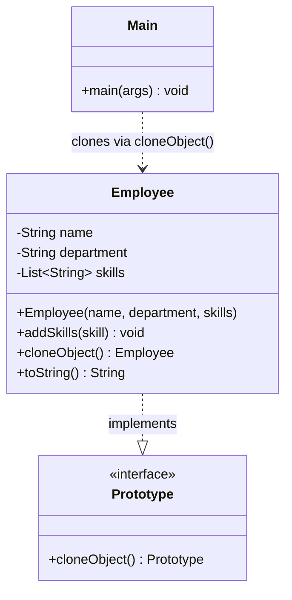
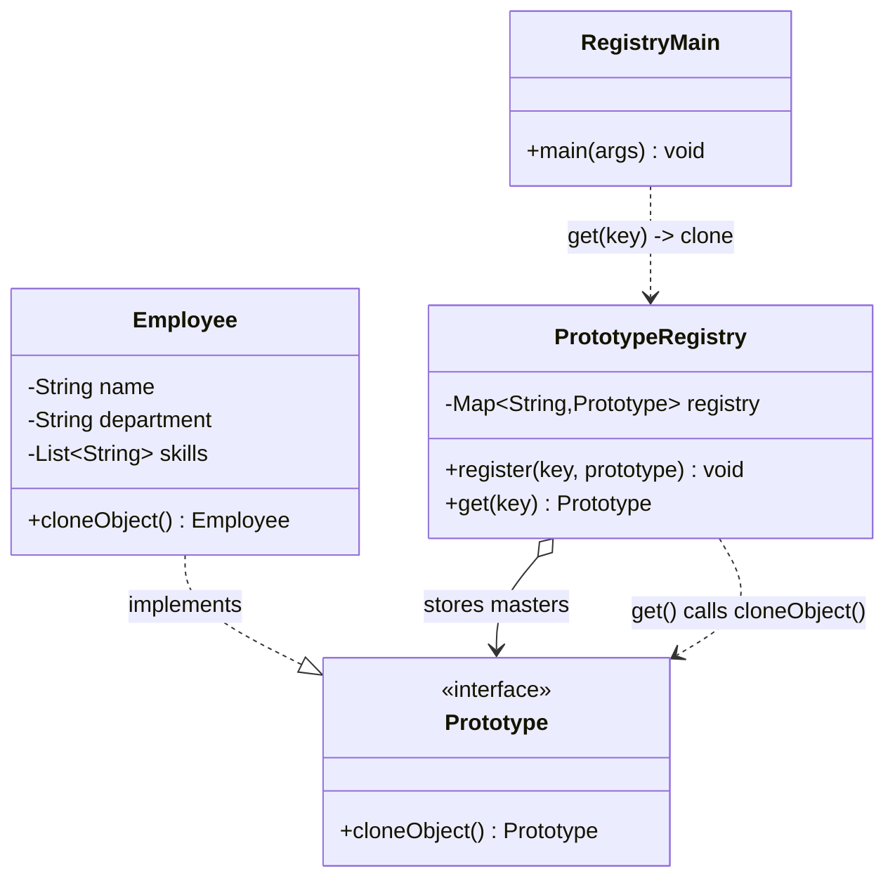
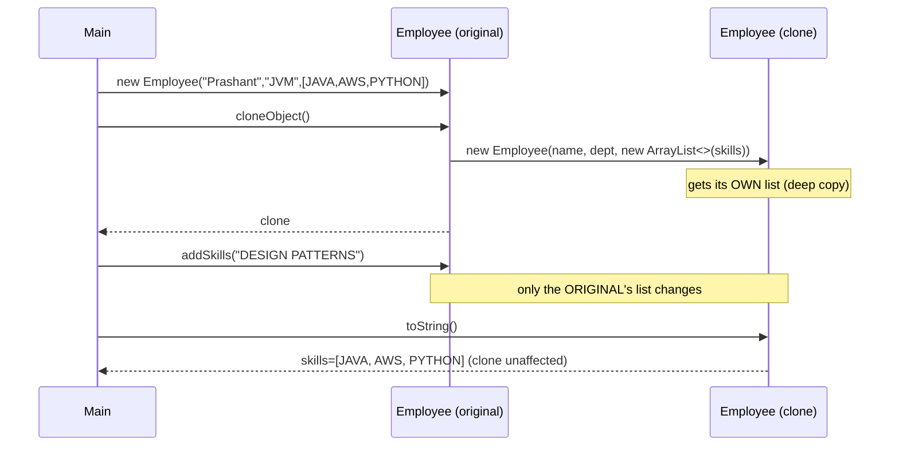
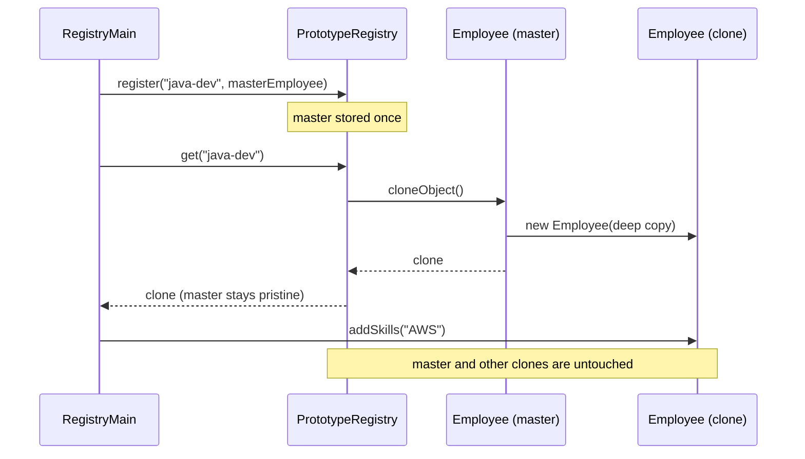

# Prototype Design Pattern — UML Diagrams

UML for this project's example: an `Employee` implements a `Prototype` interface so new
employees are made by **cloning** an existing one (with a deep copy of the mutable
`skills` list), plus the optional `PrototypeRegistry` that hands out clones by name.

---

## Class Diagram — Basic (Mermaid)



**Reading the diagram:**

| Element | Meaning | In this example |
|---|---|---|
| `Employee ..|> Prototype` | realization (implements) | Employee promises it can clone itself |
| `+cloneObject() Employee` | covariant return | overrides `Prototype` but returns the narrower `Employee` |
| `List~String~ skills` | mutable field | must be **deep-copied** inside `cloneObject()` |
| `Main ..> Employee` | dependency | client makes new objects by cloning, not `new` |

---

## Class Diagram — with Registry (Mermaid)



**Division of responsibility (registry variant):**

| Who | Does |
|---|---|
| Client (`RegistryMain`) | registers masters once, then requests clones by name |
| `PrototypeRegistry` | keeps masters in a `Map`; `get()` returns a **clone**, never the master |
| `Employee` | knows how to deep-copy itself in `cloneObject()` |

---

## Class Diagram (ASCII — generic GoF roles)

```
        ┌──────────────────────────┐
        │       «interface»        │        PROTOTYPE
        │        Prototype         │
        │──────────────────────────│
        │ + cloneObject(): Prototype│
        └────────────△─────────────┘
                     │ implements
        ┌────────────┴─────────────┐
        │         Employee         │        CONCRETE PROTOTYPE
        │──────────────────────────│
        │ - name       (String)    │  immutable → share by ref
        │ - department (String)    │  immutable → share by ref
        │ - skills     (List)      │  MUTABLE  → deep-copy!
        │ + cloneObject(): Employee│──┐
        └──────────────────────────┘  │ new Employee(name, dept,
                     ▲                 │            new ArrayList<>(skills))
          clones via │                 └──────────────────────────┐
        ┌────────────┴─────────────┐        ┌──────────────────────▼─────────┐
        │      Main / Client       │        │       PrototypeRegistry        │ (optional)
        │──────────────────────────│        │────────────────────────────────│
        │ + main()                 │        │ - registry: Map<String,Proto>  │
        └──────────────────────────┘        │ + register(key, prototype)     │
                                            │ + get(key): Prototype (a clone)│
                                            └────────────────────────────────┘
```

---

## Sequence Diagram — Basic clone + deep-copy proof (Mermaid)



---

## Sequence Diagram — Registry (Mermaid)



---

## Key Structural Points

1. **The clone lives in the object itself.** `Employee.cloneObject()` — the object is
   the only thing that knows how to correctly copy its own fields, so cloning logic
   isn't scattered across clients.

2. **Deep-copy every mutable field.** `new ArrayList<>(skills)` gives the clone its own
   list; immutable `String`s are safely shared. Skip this and clones corrupt each other —
   it's the pattern's most common bug.

3. **Covariant return removes casts.** `cloneObject()` returns `Employee`, not
   `Prototype`, so basic callers need no downcast.

4. **The registry is an optional layer.** It stores named masters and returns clones from
   `get()` — masters stay pristine, and adding a new "type" is a `register(...)` call, not
   a new class (Open/Closed). The basic example works with no registry at all.
