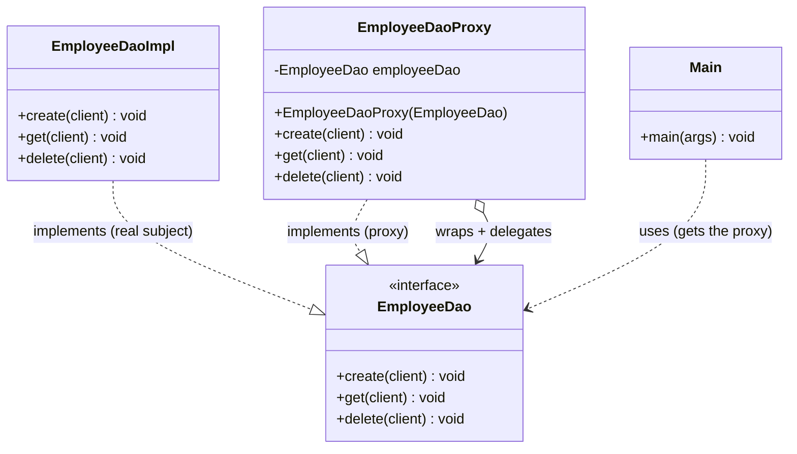
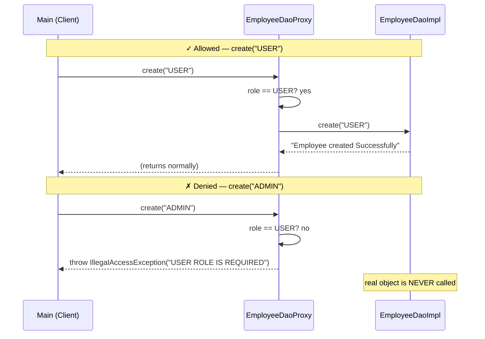
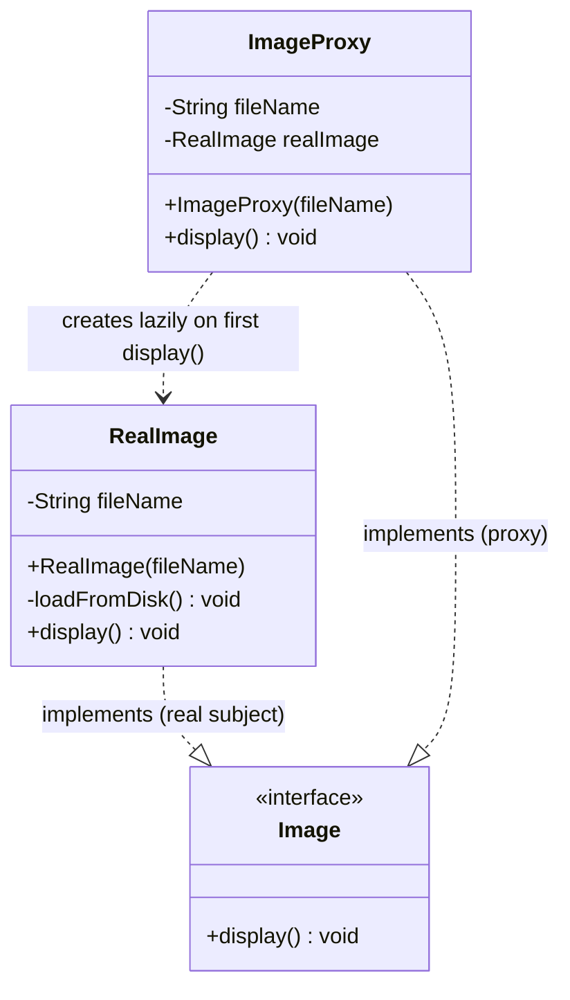
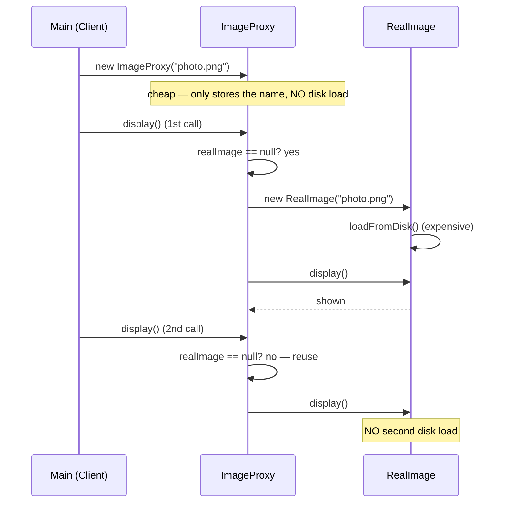
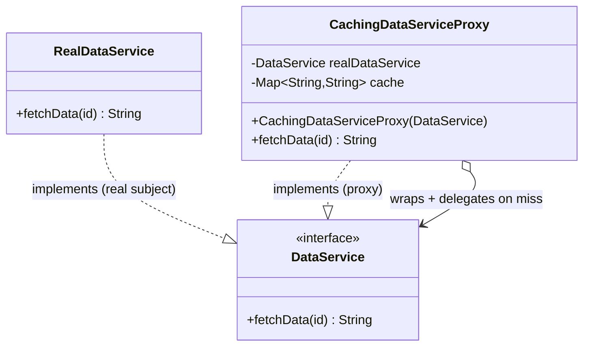
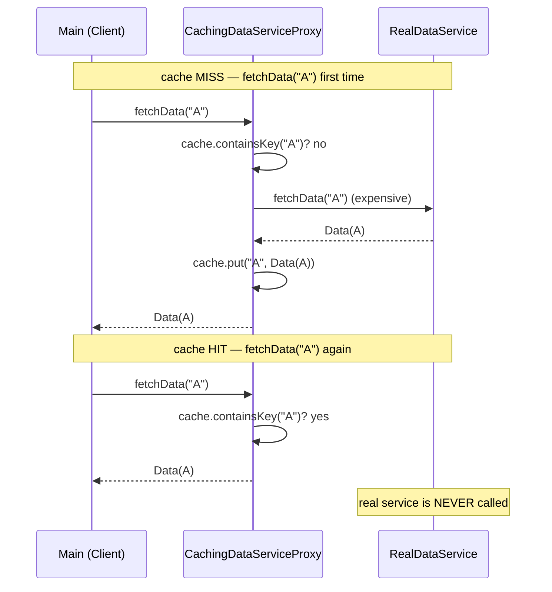

# Proxy Design Pattern — UML Diagrams

This repo implements three flavors of Proxy. They all share one shape — the proxy and
the real object implement the **same interface**, and the proxy **wraps** the real
object and does something extra before delegating. Only that "extra step" differs:

| Folder | Type | Extra step before delegating |
|---|---|---|
| `ProtectionProxy/` | Protection | role/permission check (may deny) |
| `VirtualProxy/` | Virtual | lazy-create the expensive real object on first use |
| `CachingProxy/` | Caching | return a cached result on a hit (skip the real call) |

The generic shape common to all three:

```
Client ──▶ «interface» Subject ◀─┬─ Proxy      (extra step, then maybe delegate)
                                 └─ RealSubject (the actual work)
                     Proxy o--> Subject  (wraps + delegates to RealSubject)
```

---

# 1. Protection Proxy (`ProtectionProxy/`)

`EmployeeDaoProxy` stands in for the real `EmployeeDaoImpl`, enforcing role-based access
before any call reaches the real DAO.

## Class Diagram (Mermaid)



**Reading the arrows:**

| Arrow | Meaning | In this example |
|---|---|---|
| `EmployeeDaoImpl ..|> EmployeeDao` | realization | the real object |
| `EmployeeDaoProxy ..|> EmployeeDao` | realization | proxy has the *same* interface → interchangeable |
| `EmployeeDaoProxy o--> EmployeeDao` | aggregation (has-a) | proxy holds and delegates to the real subject |
| `Main ..> EmployeeDao` | dependency | client is handed the proxy, thinks it's the real thing |

The two realization arrows into the **same** interface are the signature of Proxy
(and Decorator): the wrapper and the wrapped are substitutable.

---

## Class Diagram (ASCII — generic GoF roles)

```
                 ┌────────────────────┐
                 │        Main        │  CLIENT
                 │────────────────────│
                 │ + main()           │
                 └─────────┬──────────┘
                           │ depends on
                           ▼
                 ┌────────────────────┐
                 │    «interface»     │  SUBJECT
                 │    EmployeeDao     │
                 │────────────────────│
                 │ + create(client)   │
                 │ + get(client)      │
                 │ + delete(client)   │
                 └───△───────────△────┘
        implements  │            │  implements
        ┌───────────┘            └────────────┐
        │                                     │
┌───────────────────┐  wraps (o-->) ┌─────────────────────┐
│ EmployeeDaoProxy  │──────────────▶│  EmployeeDaoImpl    │
│───────────────────│  delegates    │─────────────────────│
│ - employeeDao     │  if allowed   │ + create(): prints  │
│ + create():       │               │ + get():    prints  │
│    check role,    │               │ + delete(): prints  │
│    then delegate  │               └─────────────────────┘
│    or throw       │   PROXY              REAL SUBJECT
└───────────────────┘   (access control)  (business logic, no checks)
```

---

## Sequence Diagram — allowed vs. denied (Mermaid)



The key contrast: on the denied path the proxy **short-circuits** — the real
subject is never touched.

---

## Access Rules Encoded in the Proxy

| Operation | Allowed role(s) | `create("ADMIN")` result |
|---|---|---|
| `create` | `USER` | ✗ denied |
| `get` | `USER` or `ADMIN` | ✓ allowed |
| `delete` | `ADMIN` | ✓ allowed |

---

# 2. Virtual Proxy (`VirtualProxy/`)

`ImageProxy` defers the expensive `RealImage` (which loads from disk in its constructor)
until the first `display()` call — and reuses it thereafter.

## Class Diagram (Mermaid)



Note the arrow is `..>` (dependency / *creates*), not `o-->`: the proxy doesn't hold the
real object up front — it **constructs** it on demand and then caches the reference.

## Sequence Diagram — lazy creation (Mermaid)



The expensive load happens on the **first** `display()`, never at construction — and not
at all if `display()` is never called.

---

# 3. Caching Proxy (`CachingProxy/`)

`CachingDataServiceProxy` remembers results in a `Map`; only the first fetch of each id
reaches the expensive `RealDataService`.

## Class Diagram (Mermaid)



## Sequence Diagram — miss vs. hit (Mermaid)



Like the protection proxy's "deny" path, a cache hit **short-circuits** — the real
object isn't touched.

---

## Key Structural Points (all three types)

1. **Proxy and real subject share one interface.** The client holds the interface type
   (`EmployeeDao` / `Image` / `DataService`) and never knows which one it has — the proxy
   is a drop-in substitute. Two realization arrows into one interface is the Proxy
   signature.

2. **The proxy *decides whether/when* to delegate.** Unlike a Decorator (which always
   forwards and adds behavior), the proxy controls the call to the real object:
   the protection proxy may **deny**, the virtual proxy **delays** creation, the caching
   proxy **skips** the call on a hit.

3. **The real subject stays clean.** `EmployeeDaoImpl` / `RealImage` / `RealDataService`
   contain zero proxy logic — the cross-cutting concern (access control, laziness,
   caching) lives entirely in the proxy (Single Responsibility).

4. **Composition, not inheritance.** The proxy *holds or creates* the real object rather
   than extending it — so it can wrap any implementation, and adding/removing the proxy
   needs no change to the real class (Open/Closed).

5. **Only the "extra step" differs.** Swap the role check for a null-check-then-create, or
   for a map lookup, and the same skeleton becomes a different kind of proxy — one pattern,
   many flavors.
