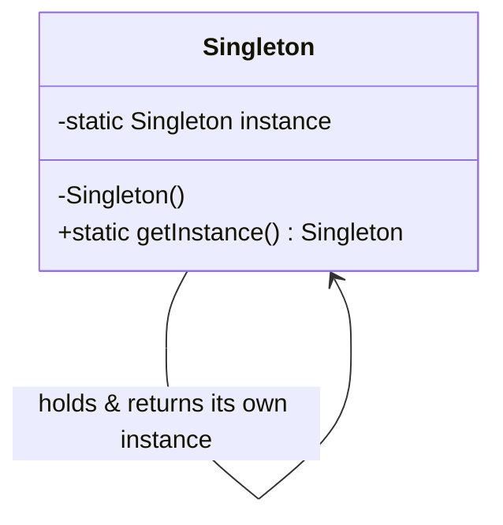
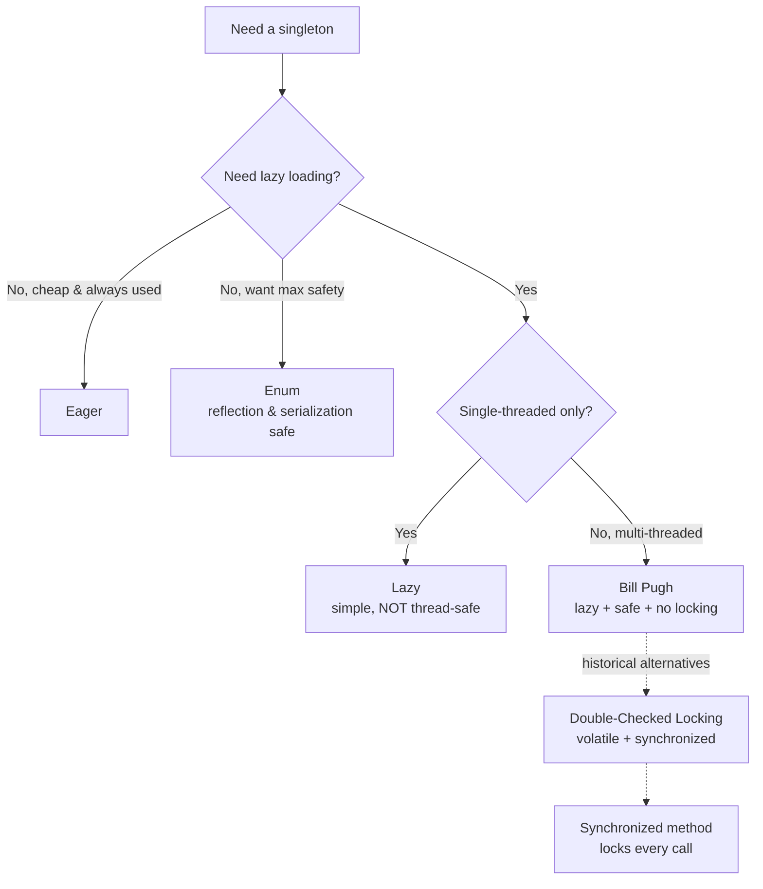
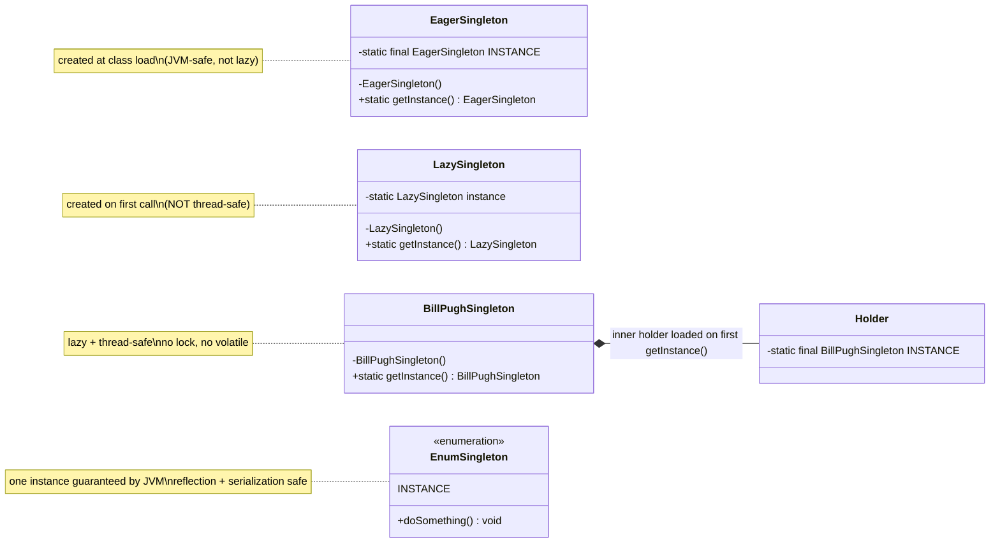
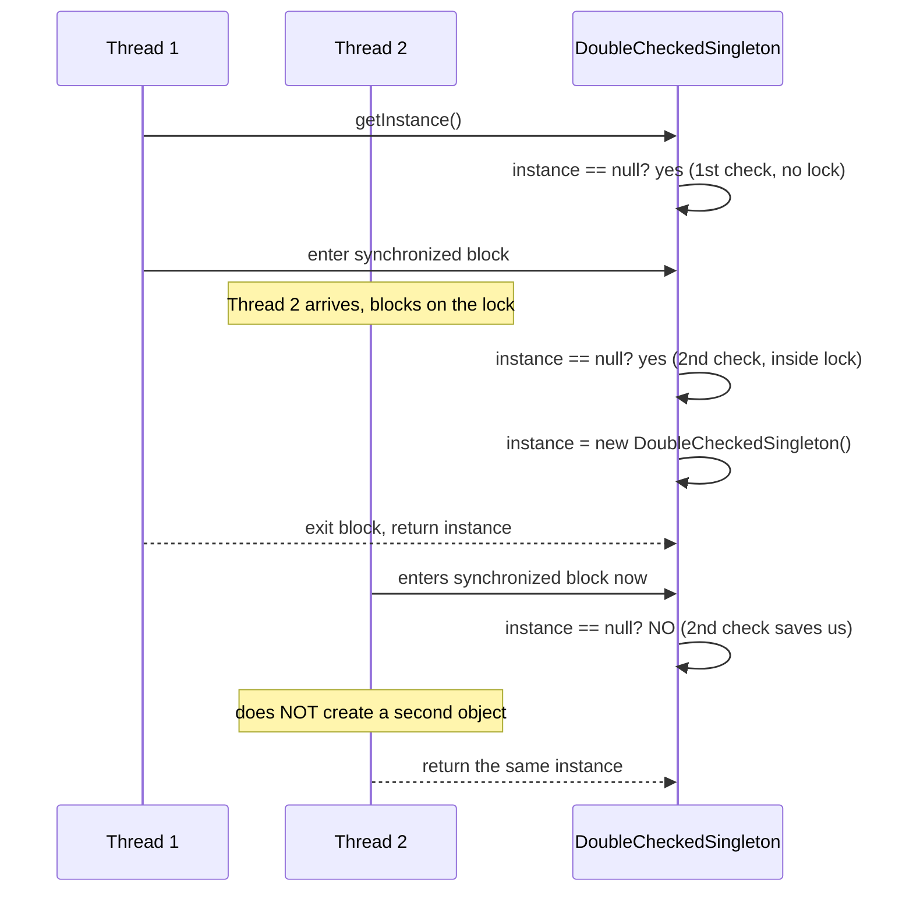

# Singleton Design Pattern — UML Diagrams

Singleton has the simplest structure of any pattern — a single class that controls its
own instantiation. What varies across the six variants isn't the shape, it's *how the one
instance is created and guarded*. This file shows the common structure, then the
per-variant creation logic.

---

## The Common Structure (all variants)



Two fixed rules, visible in the diagram:

| Element | Notation | Why |
|---|---|---|
| `-Singleton()` | private constructor (`-`) | blocks `new` from outside |
| `+getInstance()` | public **static** (`+`, underlined = static) | the one global access point |
| `-instance` | private **static** field | stores the single instance |

The self-association (`Singleton --> Singleton`) is the giveaway: the class both *is* the
type and *holds* the instance.

---

## ASCII — the canonical shape

```
        ┌────────────────────────────────┐
        │           Singleton            │
        │────────────────────────────────│
        │ - static instance : Singleton  │  ◀── the one instance lives here
        │────────────────────────────────│
        │ - Singleton()                  │  ◀── PRIVATE: no outside `new`
        │ + static getInstance():Singleton│ ◀── the only public door
        └────────────────────────────────┘
                     ▲     │
             returns │     │ creates (once)
                     └─────┘
```

---

## Variant Comparison (decision view)



---

## Per-Variant Creation Logic



---

## Sequence — Double-Checked Locking (the trickiest path)



The **second null check** is exactly what stops Thread 2 from creating a duplicate after
it was blocked. The **fast path** (post-creation) skips the lock entirely: `instance` is
non-null, so the first check returns immediately.

---

## Key Structural Points

1. **The class controls its own instantiation.** Private constructor + static accessor =
   the class is the only thing allowed to create itself. That inward control is the whole
   pattern; everything else is *how* to do it safely.

2. **Lazy vs. eager is a creation-timing choice, not a structural one.** The class diagram
   is identical; only *when* the `instance` field gets assigned changes.

3. **Thread safety comes from one of three sources.** The JVM class loader (Eager, Bill
   Pugh, Enum), or explicit locking (synchronized method, DCL), or nothing (plain Lazy —
   which is why it's unsafe).

4. **Enum is structurally different — and safest.** It has no explicit `instance` field or
   `getInstance()`; the language guarantees one instance and blocks reflection and
   serialization attacks that the class-based variants must defend against manually.
