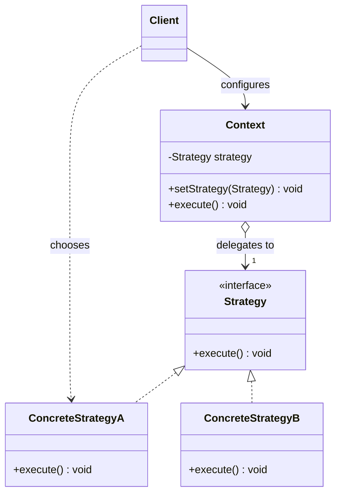
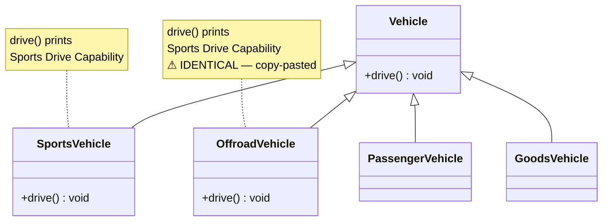
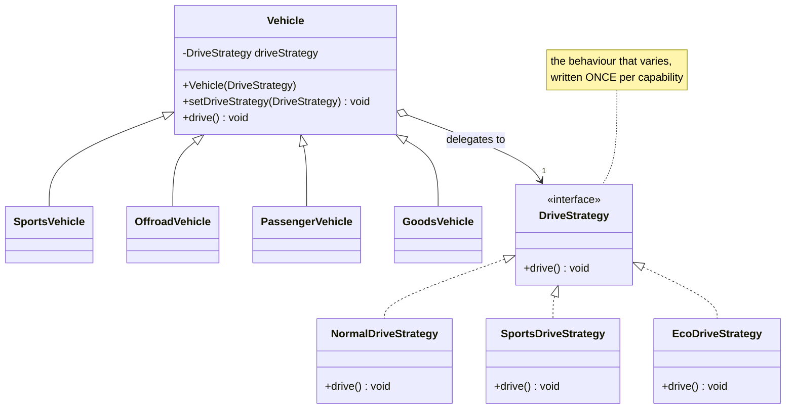
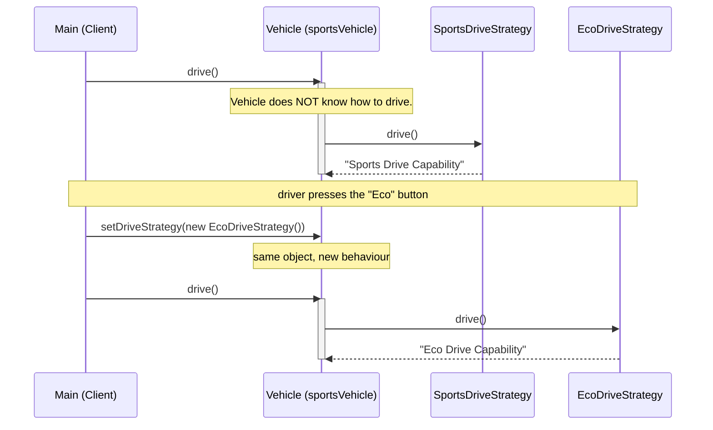

# Strategy Design Pattern — UML Diagrams

The structural signature of Strategy is a **context that owns an interface it cannot see through**.
The algorithms hang off that interface as siblings, and the context delegates without ever knowing
which one it holds.

---

## 1. The Canonical Structure



The **client** picks the strategy. The **context** just delegates. That separation is the point:
the context is closed to modification, and new algorithms arrive as new classes.

---

## 2. The Problem — `WithoutStrategyPattern`



`PassengerVehicle` and `GoodsVehicle` inherit the normal `drive()`. `SportsVehicle` and
`OffroadVehicle` **each override it with the same code**, because inheritance offers no way for two
siblings to share a method without one becoming the other's parent.

---

## 3. The Fix — `WithStrategyPattern`



| Role | Class |
|---|---|
| **Strategy** | `DriveStrategy` |
| **Concrete Strategy** | `NormalDriveStrategy`, `SportsDriveStrategy`, `EcoDriveStrategy` |
| **Context** | `Vehicle` |
| **Client** | `Main` (and the `Vehicle` subclasses, which pre-select) |

---

## 4. ASCII — Where the Duplication Went

```
  WITHOUT STRATEGY                        WITH STRATEGY
  ────────────────                        ─────────────

        Vehicle                                Vehicle
        drive() ─── "Normal"                   -driveStrategy ──────┐
           △                                       △                │
           │                                       │                │
  ┌────────┼────────┐                     ┌────────┼────────┐       │  delegates
  │        │        │                     │        │        │       ▼
Sports  Offroad  Passenger              Sports  Offroad  Passenger    «interface»
drive() drive()   (inherits)              │        │      │           DriveStrategy
  │        │                              │        │      │                 △
  ▼        ▼                              └───┬────┘      └────┐            │
"Sports" "Sports"                             │                │      ┌─────┼─────┐
   ⚠ SAME CODE, TWICE                         ▼                ▼   Normal Sports Eco
                                       SportsDriveStrategy  NormalDriveStrategy
                                        ONE object, shared

  Fix a bug in sports driving?           Fix a bug in sports driving?
  ⚠ edit 2 files, hope you find both     ✅ edit 1 file
```

`SportsVehicle` and `OffroadVehicle` now **point at the same strategy object**. They are not related
to each other, and they don't need to be — sharing happens through composition, not ancestry.

---

## 5. Sequence — Delegation, and the Runtime Swap



**This is the diagram that separates Strategy from plain dependency injection.** The `setStrategy`
call in the middle — same `Vehicle` instance, different capability, no `if`, no subclass, no rebuild
— is the reason the pattern exists. An implementation with only a constructor cannot draw this.

---

## Key Structural Points

1. **The context holds the interface, never a concrete strategy.** `private DriveStrategy` — if
   `Vehicle` ever mentions `SportsDriveStrategy` by name, the decoupling is gone.

2. **The strategy interface is small** — usually one method. That's the honest signal that you're
   varying *one algorithm*, not bridging two subsystems.

3. **`setStrategy()` is what makes it Strategy.** Constructor-only injection gives you swappability
   at *wiring* time; the setter gives it to you at *runtime*, which is the whole selling point.

4. **Strategies are siblings, not ancestors.** `SportsVehicle` and `OffroadVehicle` share behaviour
   without either inheriting from the other. Inheritance shares *downward*; Strategy shares
   *sideways*.

5. **The client chooses.** The context is deliberately ignorant. Adding `EcoDriveStrategy` required
   no change to `Vehicle` — Open/Closed, demonstrated rather than asserted.

6. **The `Vehicle` subclasses are scaffolding, not structure.** They only pre-select a strategy. If
   they ever grow real behaviour *and* both hierarchies keep growing, the pattern has become a
   **Bridge**.
