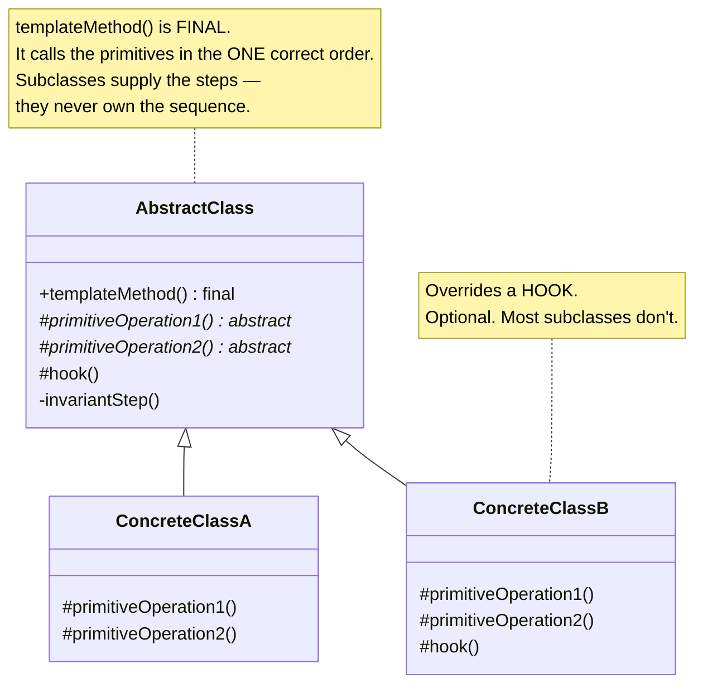
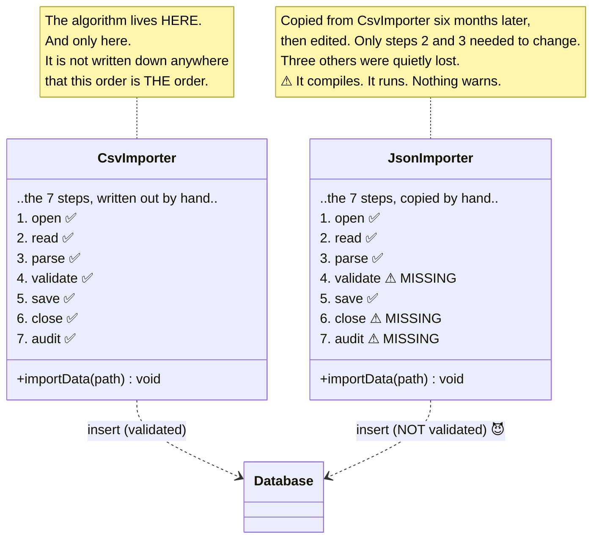
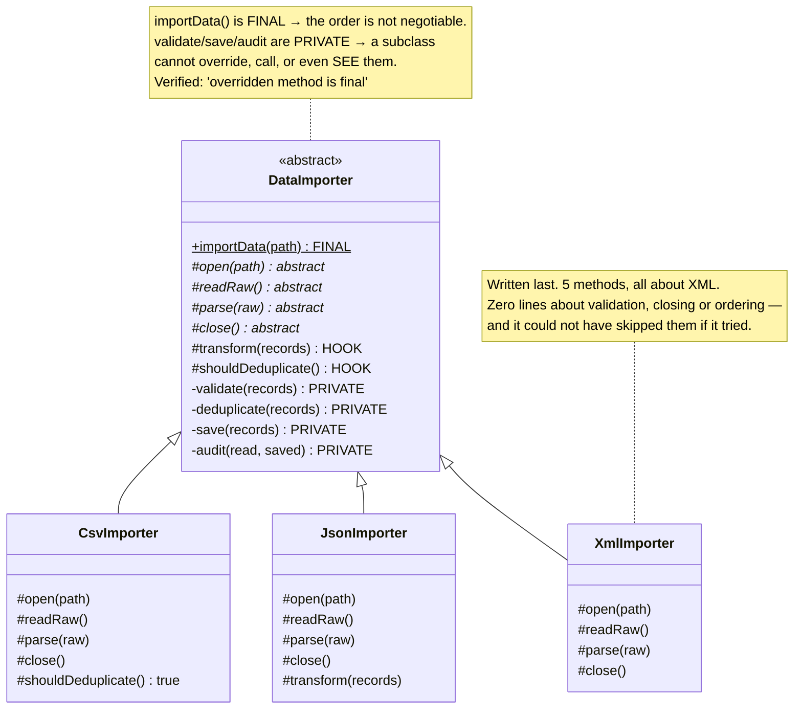
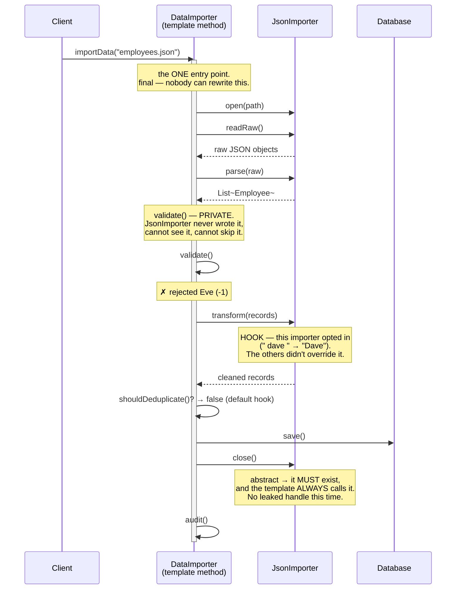

# Template Method Design Pattern — UML Diagrams

Template Method is the smallest pattern in the book: **two classes and one method.**

The method is the pattern. Everything below is about which direction the arrows point — and the
answer is the one thing that makes this pattern interesting: **they point down.** The base class
calls the subclass, not the other way round.

---

## 1. The Canonical Structure



The arrow that matters isn't drawn here, because UML has no notation for it: **`templateMethod()`
calls down into methods that don't exist yet.** The base class depends on code written after it.

---

## 2. The Problem — `WithoutTemplateMethodDesignPattern`



**No rule was broken here — because there was no rule.** The sequence existed only as a habit that got
copied by hand, and habits drift. `Eve (-1)` is now in the database and a file handle is leaking.

---

## 3. The Fix — `WithTemplateMethodDesignPattern`



| Role | This project |
|---|---|
| **Abstract Class** | `DataImporter` — owns `importData()`, the primitives, the hooks |
| **Concrete Class** | `CsvImporter`, `JsonImporter`, `XmlImporter` |
| **Template Method** | `importData()` — `final` |
| **Primitive operations** | `open`, `readRaw`, `parse`, `close` — `abstract` |
| **Hooks** | `transform`, `shouldDeduplicate` — `protected`, with defaults |
| **Invariant steps** | `validate`, `save`, `audit`, `deduplicate` — `private` |

---

## 4. ASCII — Who Owns the Sequence?

```
   WITHOUT TEMPLATE METHOD                     WITH TEMPLATE METHOD
   ───────────────────────                     ────────────────────

   ┌──────────────┐  ┌──────────────┐          ┌───────────────────────────────┐
   │ CsvImporter  │  │ JsonImporter │          │        DataImporter           │
   │ ──────────── │  │ ──────────── │          │  ───────────────────────────  │
   │ 1. open      │  │ 1. open      │          │  importData()  ← FINAL        │
   │ 2. read      │  │ 2. read      │          │  ┌─────────────────────────┐  │
   │ 3. parse     │  │ 3. parse     │          │  │ 1. open()      ────────────┼──┐
   │ 4. validate  │  │ ⚠ ······     │          │  │ 2. readRaw()   ────────────┼──┤ abstract:
   │ 5. save      │  │ 5. save      │          │  │ 3. parse()     ────────────┼──┤ the subclass
   │ 6. close     │  │ ⚠ ······     │          │  │ 4. validate()   [private]│  │  │ MUST fill
   │ 7. audit     │  │ ⚠ ······     │          │  │ 5. transform()  [hook]   │  │  │ these in
   └──────────────┘  └──────────────┘          │  │ 6. save()       [private]│  │  │
          │                 │                  │  │ 7. close()     ────────────┼──┘
          │                 │                  │  │ 8. audit()      [private]│  │
          ▼                 ▼                  │  └─────────────────────────┘  │
   the algorithm is COPIED.                    └───────────────┬───────────────┘
   Two copies. They drifted.                                   │ calls DOWN
                                                     ┌─────────┼─────────┐
   Add an 8th step?                                  ▼         ▼         ▼
   → edit every class, miss one.                  ┌─────┐  ┌──────┐  ┌─────┐
                                                  │ Csv │  │ Json │  │ Xml │
   Who owns the sequence?                         └─────┘  └──────┘  └─────┘
   → nobody. That's the bug.                   they own STEPS. Never the SEQUENCE.

                                               Add an 8th step?
                                               → one line, in one place. All three get it.
```

**The inversion is the pattern.** On the left, each subclass calls the steps — so each subclass can
get the order wrong, and one did. On the right, nobody calls the steps: **the base class calls them.**
A subclass is never asked *when* to validate, only what "open" means for its format.

That's the **Hollywood Principle** — *don't call us, we'll call you* — and it is the difference
between a library (you call it) and a framework (it calls you).

---

## 5. Sequence — One Import



Compare with the "Without" run, where the same import saved `Eve (-1)` and left the file open.

---

## Key Structural Points

1. **The template method is `final`.** This is the acceptance test for the pattern. If a subclass can
   override the algorithm, you don't have a Template Method — you have a base class with helper
   methods and a naming convention. Verified against the compiler:
   `error: overridden method is final`.

2. **Control is inverted.** The base class calls down into the subclass. The subclass supplies steps
   and never owns the sequence — which is exactly why it cannot get the sequence wrong.

3. **Three kinds of step, and the distinction is the whole design.**
   `abstract` = the subclass **must** supply it. `private`/`final` = the subclass **cannot touch** it.
   `protected` with a default = a **hook**, optional. Choosing which bucket each step goes in *is*
   designing the pattern.

4. **Invariant steps should be `private`, not `protected`.** `validate()` isn't merely "not meant to
   be overridden" — it is invisible to subclasses. Encapsulation is what makes the guarantee real
   rather than aspirational.

5. **Hooks are how it stays flexible.** `JsonImporter` normalises names; `CsvImporter` deduplicates;
   `XmlImporter` wants neither and overrides nothing. All three run the identical algorithm.

6. **The price is your one inheritance slot.** Java gives each class exactly one superclass, and this
   pattern spends it. If you need to vary two things independently, or swap behaviour at runtime, use
   **Strategy** (composition) instead — same problem, different lever. That trade-off is why modern
   frameworks like Spring name their classes `*Template` but hand you a callback rather than demanding
   a subclass.
