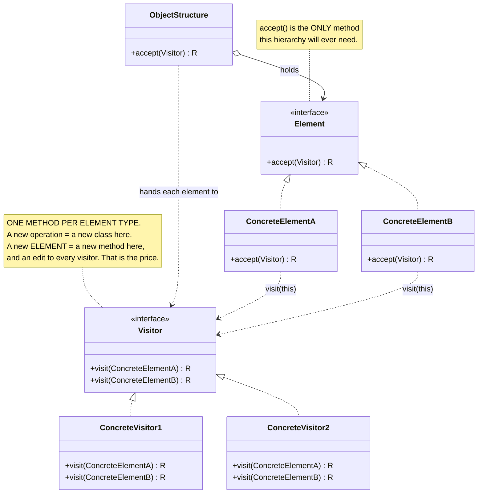
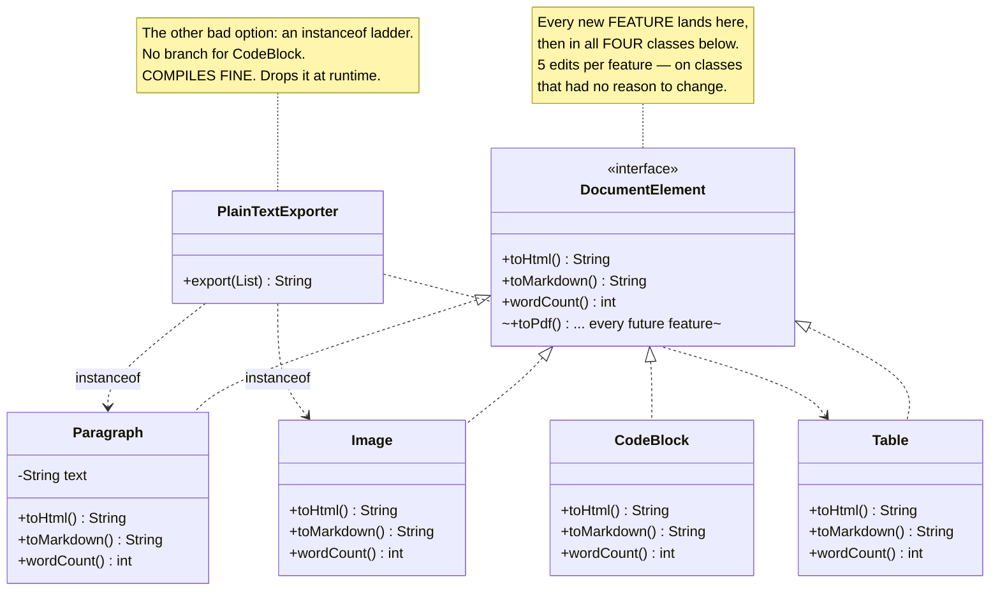
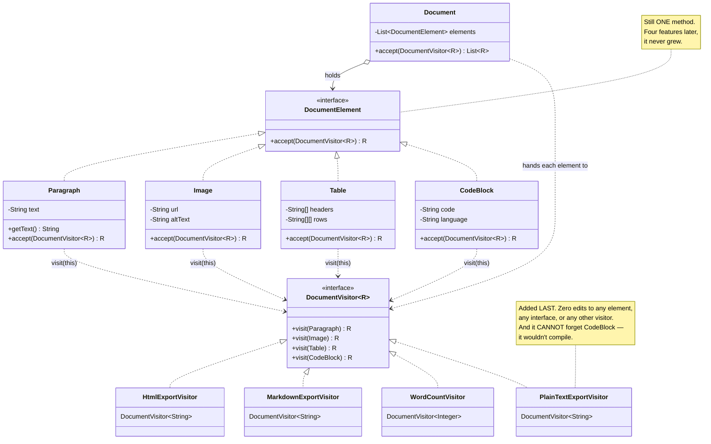

# Visitor Design Pattern — UML Diagrams

Visitor is two parallel hierarchies — **elements** and **operations over elements** — that meet in a
single line of code: `visitor.visit(this)`.

The thing to look for in the diagrams below is **which hierarchy grows when a requirement changes**.
That is the whole pattern, and it is also the whole trade-off.

---

## 1. The Canonical Structure



The two hierarchies point at each other: elements depend on `Visitor`, visitors depend on the
concrete elements. That mutual dependency is not a mistake — it is what buys the dispatch.

---

## 2. The Problem — `WithoutVisitorDesignPattern`



Note the missing arrow: `PlainTextExporter` has no line to `CodeBlock`. That absence is the bug, and
nothing in the type system objects to it.

---

## 3. The Fix — `WithVisitorDesignPattern`



| Role | This project |
|---|---|
| **Visitor** | `DocumentVisitor<R>` |
| **Concrete Visitor** | `HtmlExportVisitor`, `MarkdownExportVisitor`, `WordCountVisitor`, `PlainTextExportVisitor` |
| **Element** | `DocumentElement` |
| **Concrete Element** | `Paragraph`, `Image`, `Table`, `CodeBlock` |
| **Object Structure** | `Document` |

---

## 4. ASCII — Which Grid Cell Do You Have to Edit?

Every design here is really a table of *(element × operation)* cells. The question is only ever:
**when something changes, do I edit a row or a column?**

```
                     Paragraph   Image   Table   CodeBlock
                   ┌──────────┬────────┬───────┬───────────┐
   toHtml()        │          │        │       │           │
                   ├──────────┼────────┼───────┼───────────┤
   toMarkdown()    │          │        │       │           │
                   ├──────────┼────────┼───────┼───────────┤
   wordCount()     │          │        │       │           │
                   └──────────┴────────┴───────┴───────────┘

   WITHOUT VISITOR — behaviour is grouped by COLUMN (one class per element)
   ───────────────────────────────────────────────────────────────────────
      new ELEMENT    → add a column        → ✅ ONE new class
      new OPERATION  → add a row           → ⚠ edit EVERY existing class
                                             (+ the interface). 5 edits.

   WITH VISITOR — behaviour is grouped by ROW (one class per operation)
   ───────────────────────────────────────────────────────────────────
      new OPERATION  → add a row           → ✅ ONE new class. Nothing else moves.
      new ELEMENT    → add a column        → ⚠ edit EVERY existing visitor.
                                             The compiler forces you to. That's the price.
```

**Visitor rotates the grid.** It does not remove work; it moves the work to the axis that changes
less. So the only question you ever need to ask before reaching for it is:

> *Which axis of my grid is actually growing — the elements, or the operations?*

Elements stable, operations exploding (an AST, a document model, a shape hierarchy) → **Visitor.**
Elements exploding, operations stable → **leave the methods on the classes and walk away.**

---

## 5. Sequence — Double Dispatch, Step by Step

This is the diagram worth staring at. Watch how the element's *real type* is recovered without a
single `instanceof`.

```mermaid
sequenceDiagram
    participant C as Client
    participant D as Document (object structure)
    participant P as Paragraph (element)
    participant V as HtmlExportVisitor

    C->>D: accept(new HtmlExportVisitor())
    activate D
    Note over D: walks its elements (Iterator's job)

    D->>P: accept(visitor)
    activate P
    Note over D,P: ① FIRST DISPATCH — virtual call.<br/>Java picks Paragraph.accept() at RUNTIME.<br/>The element's true type is now known.

    P->>V: visit(this)
    activate V
    Note over P,V: ② SECOND DISPATCH — inside Paragraph,<br/>`this` is statically a Paragraph, so the<br/>compiler binds the visit(Paragraph) overload.<br/>WHICH visitor runs is chosen at runtime.

    Note over V: the (Paragraph × Html) cell —<br/>exactly one grid cell, reached with<br/>zero instanceof
    V-->>P: "&lt;p&gt;…&lt;/p&gt;"
    deactivate V
    P-->>D: "&lt;p&gt;…&lt;/p&gt;"
    deactivate P

    Note over D: …repeat for Image, Table, CodeBlock
    D-->>C: List~String~
    deactivate D
```

Two calls. The first selects on the **element's** type, the second on the **visitor's** type. Between
them they pick one cell out of the grid in §4 — which is the thing a single virtual call cannot do,
and the thing the `instanceof` ladder was clumsily simulating.

**The one-sentence version:** the element already knows what it is, so rather than let the operation
interrogate it (`instanceof`), the element **introduces itself** — `visit(this)`.

---

## Key Structural Points

1. **`accept()` is the only method the element hierarchy will ever need.** Four features in, and
   `DocumentElement` still has exactly one method. That is Open/Closed working, finally pointing the
   right way.

2. **`visitor.visit(this)` is the whole pattern.** Everything else is scaffolding around those two
   words. If you understand why `this` is statically typed there, you understand double dispatch.

3. **Two dispatches, two different types, one grid cell.** Runtime dispatch on the element, compile-time
   overload selection on the element's static type, runtime dispatch on the visitor. Java gives you
   single dispatch; Visitor builds double dispatch out of two of them.

4. **The compiler becomes your exhaustiveness check.** A new element type breaks every visitor *at
   compile time*. Painful — and enormously better than the "Without" project, where the same change
   compiled cleanly and silently dropped a `CodeBlock` out of production exports.

5. **The Object Structure is a real role.** `Document` owns the traversal, written once, reused by
   every visitor. This is where Visitor and Iterator meet: the loop is Iterator, the `accept()` inside
   it is Visitor.

6. **The mutual dependency is deliberate.** Elements know `Visitor`; visitors know every concrete
   element. You cannot have double dispatch without both halves knowing about each other — and it is
   also why adding an element is the expensive move.

7. **In modern Java, check `sealed` + pattern-matching `switch` first.** A `switch` over a sealed
   hierarchy gets you the same compiler-enforced exhaustiveness without `accept()` or a visitor
   interface. Visitor still earns its keep when the hierarchy isn't yours to seal, or when a visitor
   must carry state across a whole traversal — but the days of reaching for it reflexively are over.
